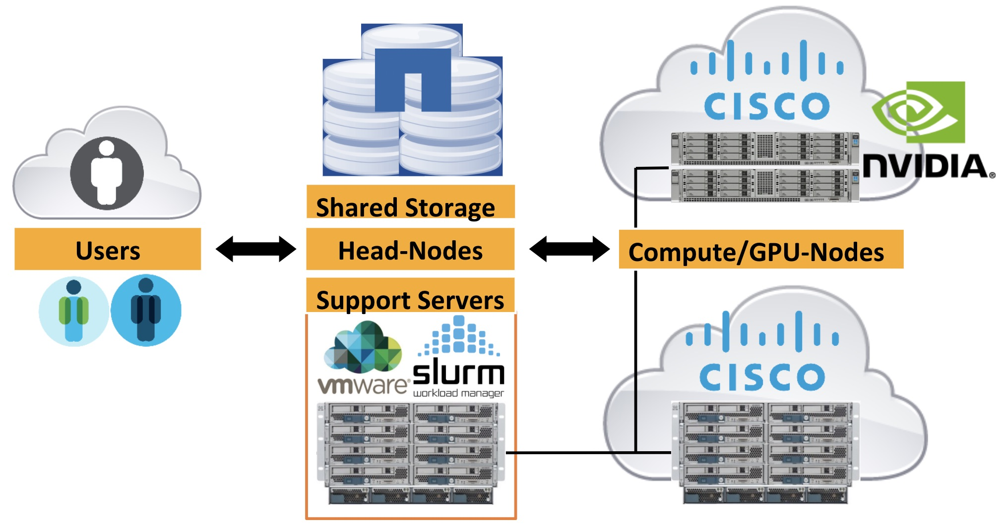

## Obtaining Access to the Cluster

If you're reading this page, you almost certainly have it by now. So, this
section will focus mainly on being a central location for existing users to
reference in helping potential new users get access.

* Request an Account: <http://www.deac.wfu.edu/accounts.html>
* Review Cluster Policies: <https://wiki.deac.wfu.edu/index.php/Category:Policy>
* Request access to licensed software: Certain licensed software requires
  electronic acceptance of the licenses. To determine if the software you wish
  to use requires these extra measures, please view
  <https://wiki.deac.wfu.edu/index.php/Category:License> for a list of software
  with special requirements.

## General Cluster Layout

## Accessing Cluster Resources

There are three primary entry points in which users connect to the cluster for
various resources:

1. **Web Sites** - There are four web sites users typically would use most
   often:
    * Public-facing cluster website - <http://www.deac.wfu.edu/> - provides all
      sort of relatively static information about the cluster, highlighting its
      capabilities and publicizing some interesting results.
    * Cluster Support Wiki website - <https://wiki.deac.wfu.edu/> - public
      content that provides useful information (such as this article) for
      cluster users new and old.
    * Cluster YouTube Channel -
      <https://www.youtube.com/channel/UCmdgQr8V1jfOQCkmvdHTZuw> (or Search for
      DEAC Cluster) - provides video tutorials for common training content.
    * Cluster Twitter Page - <https://twitter.com/WakeHPC> - provides public
      announcements and updates regarding the DEAC cluster.
2.  **Shell Access** via SSH - Users connect to the interactive login nodes,
    aka [Head Nodes](Cluster:Headnodes "wikilink"), using the SSH protocol,
    provided by any number of freely available clients (OpenSSH, putty, etc.).
    This is the only protocol supported for command line access (i.e.
    interactive logins) to the cluster and is available from the general
    Internet without restriction. The [Quick Start
    Guide:SSH](Quick_Start_Guide:SSH "wikilink") is a good place to start.    
3.  **File Transfer** via SCP/SFTP - Users can migrate data onto and off of the
    cluster using secure file transfer protocols, also based on the underlying
    SSH protocol suite. The utilities, which are also freely available
    (OpenSSH, WinSCP, etc.) work similar to historical FTP clients but securely
    authenticate and transfer the files between destination.
