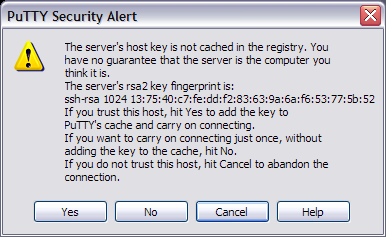

====================
DEAC Advanced Topics
====================

.. toctree::


-------------------------
Connecting to the cluster
-------------------------


SSH
===

**SSH** provides an encrypted terminal session from one computer to another: all
commands that you type and all output from the remote machine are scrambled. It
normally communicates over port 22.


Linux/Unix/Mac OS X
-------------------

* Start a terminal program
* Type the command -- note that that is an uppercase "Y", not lowercase:

.. code:: bash

    $ ssh -A -Y username@<headnode.deac>

* If this is your first time connecting, you will get a warning::

    The authenticity of host 'headnode.deac (152.17.36.129)' can't be established.
    RSA key fingerprint is  13:75:40:c7:fe:dd:f2:83:63:9a:6a:f6:53:77:5b:52
    Are you sure you want to continue connecting (yes/no)? yes
    Warning: Permanently added '<headnode.deac>' (RSA) to the list of known hosts.

* At the :code:`Are you sure you want to continue connecting?` prompt, you must
  type in the full word "yes".
* The :code:`-Y` option allows for *X11 forwarding* so that GUI-based
  applications can be displayed on the local machine.


Windows
-------------------

You will need the `PuTTY`_ program. Using PuTTY is more complicated than using
ssh in Linux. You will need to set up "profiles" for each host you wish to
connect to.

* PuTTY is installed on your WFU laptop as part of the standard load.
* Otherwise, you may `download it`_ (Choose putty.exe).
* The first time you run PuTTY, you will see:

.. image:: images/Putty_01.png

* To create a new profile:

    1. Enter a hostname or IP address in the "Host Name (or IP Address)" box
       near the top of the window; make sure the "SSH" button is selected
    2. Enter the same host name in the empty box right below "Saved Sessions"
    3. In the left sidebar (Category:), click on "Data" in the "Connection"
       category -- you will see a new form on the right
    4. In the "Login Details" section, enter your own username in "Auto-login
       username"

    .. image:: images/Putty_02_1.png

    5. Then, click back on the "Session" category in the left sidebar, and click
       ;the "Save" button

* To connect to the host, double-click the saved session name.
* If it is the first time you are logging into a headnode from this Windows
  machine, you will see a "security alert" -- just click "Yes" to continue
  connecting:



For more information, including getting GUI applications from the cluster to
display on your Windows computer, see :doc:`Using the Cluster from a Windows
system <cluster/Using_from_Windows>`.


See Also
--------

Training Video
``````````````

* DEAC Login with PuTTY Training Video

.. raw:: html

    <div style="position: relative; padding-bottom: 56.25%; height: 0; overflow: hidden; max-width: 100%; height: auto;">
        <iframe src="https://youtu.be/3rl7otU9Evw" frameborder="0" allowfullscreen style="position: absolute; top: 0; left: 0; width: 100%; height: 100%;"></iframe>
    </div>


Helpful Links
`````````````

* `SSH Tutorial for Linux`_
* `Public key-based authentication for passwordless login`_

.. _`PuTTY`: https://www.chiark.greenend.org.uk/~sgtatham/putty/
.. _`download it`: https://www.chiark.greenend.org.uk/~sgtatham/putty/download.html
.. _`SSH Tutorial for Linux`: https://support.suso.com/supki/SSH_Tutorial_for_Linux
.. _`Public key-based authentication for passwordless login`: https://sial.org/howto/openssh/publickey-auth
