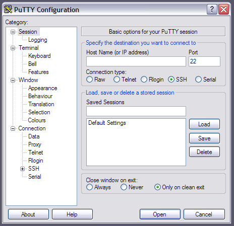
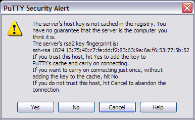

====================
DEAC Beginners Guide
====================

.. #############################################################################
.. #############################################################################
.. #############################################################################
.. #############################################################################

---------------------
Common Linux Commands
---------------------

This is a summary of many commonly used Linux commands. We also recommend the
`FOSSwire Unix/Linux Command Reference`_ and the `Stanford University
OpenClassroom's "Practical Unix" class`_. We also have a more in-depth Linux
guide at :doc:`information_linux`.

File Commands
=============

* ``ls`` -- directory listing
* ``ls -al`` -- formatted listing with hidden files
* ``cd dir`` -- change directory to ``dir``
* ``pwd`` -- show current directory (Print Working Directory)
* ``mkdir dir`` -- create a directory ``dir``
* ``rm file`` -- delete `file`
* ``rm -r dir`` -- delete directory ``dir`` and all its contents
* ``rm -f file`` -- force delete file
* ``rm -rf dir`` -- force delete directory ``dir`` and all its contents (use with caution)
* ``cp file1 file2`` -- copy ``file1`` to ``file2`` (overwrites ``file2`` if it exists)
* ``cp -r dir1 dir2`` -- copy ``dir1`` to ``dir2``; create ``dir2`` if it doesn't exist
* ``mv file1 file2`` -- rename ``file1`` to ``file2`` (overwrites ``file2`` if it exists)
* ``mv file dir`` -- move ``file`` into directory ``dir``
* ``ln -s file_or_dir link`` -- create a symbolic link ``link`` pointing to ``file_or_dir``
* ``touch file`` -- create empty ``file``; if ``file`` exists, updates last-modified date
* ``less file`` -- view contents of ``file``
* ``head file`` -- output first 10 lines of ``file``
* ``tail file`` -- output last 10 lines of ``file``
* ``tail -f file`` -- output contents of ``file`` as it grows, starting with last 10 lines

Process Management
==================

* ``ps`` -- display your currnet active processes
* ``top`` -- display all running processes
* ``kill pid`` -- kill process id ``pid`` (numerical ID)
* ``bg`` -- lists stopped or background jobs; resume a stopped job in the background
* ``fg`` -- brings the most recent job to the foreground
* ``fg n`` -- brings job ``n`` to the foreground

File Permissions
================

* ``chmod mode file`` -- change permissions of ``file`` to given ``mode``; mode
  can be ``[ugoa...][[+-=][perms...]...]``

    * ``u, g, o, a`` -- specify the owner: ``user``, ``group``, ``other``, or ``all``
    * ``+, -, =`` -- ``+`` adds given permissions to file, ``-`` removes given
      permissions from file, ``=`` sets given permissions on file
    * ``perms : r, w, x`` or any combination of the three -- ``r`` means read
      permission, ``w`` means write permission, ``x`` means execute (file) or cd
      (directory) permission

Searching Within Files
======================

These commands can be used to find content within files:

* ``grep pattern files`` -- print out lines containing ``pattern`` in ``files``
* ``grep -r pattern dir`` -- print out lines containing ``pattern`` in all files
  found recursively descending into directory ``dir``
* ``command | grep pattern`` -- print out lines from the output of ``command``
  which contain ``pattern``

System Info
===========

* ``date`` -- show current date and time
* ``cal`` -- show this month's calendar
* ``cal year`` -- show calendar for entire ``year``
* ``uptime`` -- show how long the machine has been up
* ``w`` -- display users who are logged in
* ``whoami`` -- who you are logged in as
* ``id`` -- print all user ID information for yourself
* ``finger user`` - display information about ``user``
* ``uname -a`` -- show information about machine
* ``cat /proc/cpuinfo`` -- cpu information
* ``cat /proc/meminfo`` -- memory information
* ``man command`` -- show manual for ``command``
* ``df -h`` -- show disk usage
* ``free`` -- show memory and swap usage
* ``whereis command`` -- show possible paths to ``command``
* ``which command`` -- show absolute path to ``command``

Compression
===========

* ``tar cf dir.tar dir`` -- create a tar file named `dir.tar` containing all
  files in the directory `dir`
* ``tar xf dir.tar`` -- extract all files from `dir.tar`
* ``tar zcf dir.tar.gz dir`` -- create a gzipped tar file named `dir.tar.gz`
  containing all files in `dir`
* ``tar zxf dir.tar.gz`` -- extract all files from `dir.tar.gz`
* ``tar jcf dir.tar.bz2 dir`` -- create a tar file named `dir.tar.bz2` compressed
  with bzip2 containing all files in `dir`
* ``tar jxf dir.tar.bz2`` -- extract all files from `dir.tar.bz2`
* ``gzip file`` -- compress `file` and rename it `file.gz`
* ``gzip -d file.gz`` -- uncompress `file.gz` into `file`

Network
=======

* ``jwhois domain`` -- print administrative and contact information for the owner of `domain`
* ``dig domain`` -- print DNS information for `domain`
* ``dig -x host`` -- print reverse DNS lookup of `host`
* ``wget url`` -- download the file at `url`
* ``wget -c url`` -- resume a stopped download

Package Installation from Source
================================

Typical GNU-style source packages for software follow this recipe for building:

.. code-block:: console

   $ ./configure --prefix=$HOME/dir
   $ make
   $ make install

You can also :doc:`read our in-depth guide to compiling software <compiling>` on
DEAC, for software packages that require considerably more work than this.

Other Useful Commands
=====================

* ``Ctrl-C`` -- halts the current command (send signal ``SIGINT``)
* ``Ctrl-Z`` -- pauses the current command
* ``fg`` -- resumes a ``Ctrl-Z``'ed command
* ``bg`` -- resumes a ``Ctrl-Z``'ed command into the background (returning terminal control)
* ``!!`` -- repeats the last command
* Up and Down keys on your keyboard -- browse command history

.. #############################################################################
.. #############################################################################
.. #############################################################################
.. #############################################################################

-------------------------
Connecting to the cluster
-------------------------

SSH
===

**SSH** provides an encrypted terminal session from one computer to another: all
commands that you type and all output from the remote machine are scrambled. It
normally communicates over port 22.

Linux/Unix/Mac OS X
-------------------

* Start a terminal program
* Type the command -- note that that is an uppercase "Y", not lowercase:

.. code:: bash

    $ ssh -A -Y username@<headnode.deac>

* If this is your first time connecting, you will get a warning::

    The authenticity of host 'headnode.deac (152.17.36.129)' can't be established.
    RSA key fingerprint is  13:75:40:c7:fe:dd:f2:83:63:9a:6a:f6:53:77:5b:52
    Are you sure you want to continue connecting (yes/no)? yes
    Warning: Permanently added '<headnode.deac>' (RSA) to the list of known hosts.

* At the :code:`Are you sure you want to continue connecting?` prompt, you must
  type in the full word "yes".
* The :code:`-Y` option allows for *X11 forwarding* so that GUI-based
  applications can be displayed on the local machine.

Windows
-------------------

You will need the `PuTTY`_ program. Using PuTTY is more complicated than using
ssh in Linux. You will need to set up "profiles" for each host you wish to
connect to.

* PuTTY is installed on your WFU laptop as part of the standard load.
* Otherwise, you may `download it`_ (Choose putty.exe).
* The first time you run PuTTY, you will see:



* To create a new profile:

    1. Enter a hostname or IP address in the "Host Name (or IP Address)" box
       near the top of the window; make sure the "SSH" button is selected
    2. Enter the same host name in the empty box right below "Saved Sessions"
    3. In the left sidebar (Category:), click on "Data" in the "Connection"
       category -- you will see a new form on the right
    4. In the "Login Details" section, enter your own username in "Auto-login
       username"

    .. image:: images/Putty_02_1.png

    5. Then, click back on the "Session" category in the left sidebar, and click
       the "Save" button

* To connect to the host, double-click the saved session name.
* If it is the first time you are logging into a headnode from this Windows
  machine, you will see a "security alert" -- just click "Yes" to continue
  connecting:



For more information, including getting GUI applications from the cluster to
display on your Windows computer, see :doc:`Using the Cluster from a Windows
system <cluster/Using_from_Windows>`.

See Also
--------

Training Video
``````````````

* DEAC Login with PuTTY Training Video


.. raw:: html

    <div style="text-align: center; margin-bottom: 2em;">
    <iframe width="100%" height="480" src="https://www.youtube.com/embed/3rl7otU9Evw?rel=0" frameborder="0" allow="autoplay; encrypted-media" allowfullscreen></iframe>
    </div>

Helpful Links
`````````````

* `SSH Tutorial for Linux`_
* `Public key-based authentication for passwordless login`_


.. _`PuTTY`: https://www.chiark.greenend.org.uk/~sgtatham/putty/
.. _`download it`: https://www.chiark.greenend.org.uk/~sgtatham/putty/download.html
.. _`SSH Tutorial for Linux`: https://support.suso.com/supki/SSH_Tutorial_for_Linux
.. _`Public key-based authentication for passwordless login`: https://sial.org/howto/openssh/publickey-auth
.. _`FOSSwire Unix/Linux Command Reference`: https://files.fosswire.com/2007/08/fwunixref.pdf
.. _`Stanford University OpenClassroom's "Practical Unix" class`: http://openclassroom.stanford.edu/MainFolder/CoursePage.php?course=PracticalUnix
