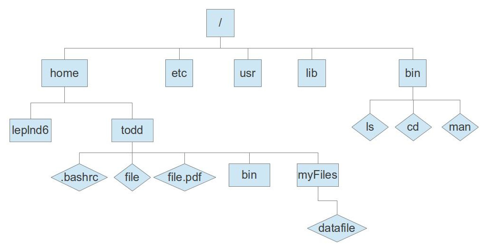

==============
Intro to Linux
==============

Linux is a free operating system based on open source development. This means
the source code (most written in C) is freely available for anyone to read and
if you really want, to edit. As a consequence of this model, Linux (and other
operating systems derived from unix such as macOS) rely on a series of discrete
tools to make the operating system work together, rather than one integrated
graphical layer.

This introduction will specifically cover commandline Linux as that is the
environment on the DEAC Cluster. If you use putty under Windows, or some other
ssh tool to log in to the cluster, this is the only flavor of Linux you will be
exposed to. If you have a local Linux installation, macOS or other unix
derivative, almost everything said here should apply in the "terminal"
application available in that operating system.

Because Linux is based around a series of tools that all do one job well, it has
a lot of power. Much of that power comes from knowing how the tools can work
together, but knowing the basic tools is the most important.

This isn't intended to teach you everything about a tool, but to provide an
introduction and show you a little of what Linux can do. For more complete
advice on a given command, use the command ``man commandIwanttolearnabout``
(e.g. ``man ls``) or consult a search engine. To search the manual pages for a
command with a given feature, use ``man -k`` or ``apropos``.

.. #############################################################################
.. #############################################################################

------------------
The Command Prompt
------------------

When you originally log in to a Linux system you are greeted by the command
prompt. The command prompt is a type of language with it's own syntax. You can
write your first script on the commandline by giving the command: ``echo 'Hello
world!``

There are a couple different varieties of command line environments. To see what
environment you are in use the command: ``echo $0``. The answer should come back
as something like ``bash``, ``tcsh``, ``csh``, ``zsh``, or ``fish``.

You can also do math on the commandline. If you are in a bash shell use the
command: ``echo $((4+5))``. If you are in tcsh (t shell) use the command: ``@ a
= ( 4 + 5 ); echo $a``.

---------------------
Files and Directories
---------------------

In Linux (and other OSs) files are organized in something called the directory
tree. The "root" of the tree is ``/``, also known as the root directory. Try to
use the command 'cd' to get to root. (i.e. ``cd /`` ). Use ``pwd`` to see what
directory you are in. Use ``ls`` to see what files and directories are in the
directory you are in.

    A schematic of the Linux directory tree

Directories
===========

Now hit ``cd`` and don't provide an argument, this will return you to your
"home" directory. (``/home/username``). You can also get to your home directory
by using 'cd ~'. Use the command ``mkdir testcase`` to make a subdirectory
called testcase in your home directory. Use the command ``cd -`` to return to
the last directory you were in (in this case root). Now use the command ``cd
~/testcase`` to change directory into jthe testcase directory in your home
directory. The shell will expand ``~`` to mean "this user's home directory". Use
the command ``pwd; cd .; pwd``. The semicolon allows you to use multiple
commands on the same command line. This should produce the output: ``~/testcase
~/testcase``. means the directory I'm currently in. Now try ``cd ..`` This
should move you up one directory (towards root) in the directory tree. In this
case you should be back to your home directory.

Files
=====

Type ``ls``. This should provide you a list of the files and directories in your
home folder. Type ``ls -a``. This should provide you a listing of ALL the files
and directories in your current directory. You may see a bunch of
files/directories you didn't see before, beginning with ``.``. Beginning a file
or directory name with a ``.`` in Linux makes the directory or file hidden.
Create an empty hidden file with the command ``touch .myhiddenfile``. Now use
``ls`` and ``ls -a``.

Write some data to that file using the command: ``echo "This is some data for
the file, llama" \> .ahiddenfile`` View the contents of the file with the
command ``less .ahiddenfile`` (exit less by hitting ``q``). Use grep to search
through all the files in the directory for the term llama with the command
``grep "llama" *``

The ``*`` character is a wildcard meaning it matches all files. So grep was
instructed to look in all the files in the directory for "llama". You could also
give a filename explicitly (e.g. ``grep "llama" .ahiddenfile``).

More Commands
=============

You can also move (``mv``) files and directories (which doubles as a rename
feature). ``cp`` will copy files and ``cp -r`` will copy directories. (the -r is
for recursive, as it will enter the directory and all subdirectories
recursively.) ``rm`` will delete files and ``rm -r`` will delete directories.

---------------------------
Customizing your experience
---------------------------

You have a fair amount of control over what your commandline environment is
like. In your home directory there should be a file called ``.yourshellrc``
(i.e. ``.bashrc`` or ``.tcshrc``). This shell defines what commands your system
knows through the use of environment variables. This file isn't magical or
special, it's just a series of commands that get run every time you login. You
can override them by issuing new commands at the commandline that redefine these
variables.

The ``$PATH`` environment variable tells the shell where to look for
executables. If you reset your path using the syntax ``export PATH=~`` (for
Bash) ``set path = ~`` (for tcsh) then your commandline environment will only
look in your home directory for many of the programs you might want to use. That
means it won't be able to find ``ls``, ``cd``, or any of the other commands
mentioned here. If you reset your path like this, you'll probably want to
restore the shell to the default environment, either by using the exit command
(or ``CTRL+d``) and logging in again, or by typing ``source ~/.bashrc`` or
``source ~/.tcshrc`` to reload your default settings. Even without resetting the
path you can still use ``ls``, ``cd``, etc. by giving the full path (beginning
at root) to the command (i.e. ``/bin/ls``)

A typical path setting includes all the binaries in /bin, /usr/bin/,
~/bin, and maybe a few others. If you write your own scripts you'd like
to execute, putting them in ~/bin is a good way to save yourself the
trouble of having to type out the full path to whatever executable you
want.

You can create a new name for a command using the command ``alias x=Y``. (e.g.
alias ``rm = "rm -i"``).

--------------------
Making things easier
--------------------

You can use your history to repeat a previous command. Navigate through your
history using the up and down arrow keys. You can use the command ``history`` to
see a list of your history.

Aliases
=======

Set aliases for commands you perform often. Common or suggested aliases include:

.. code-block:: bash

    ll = ls -l (for ls list mode)
    cd1 = cd ..
    cd2 = cd ../..
    cd3 = cd ../../../
    rm = rm -i # (harder to accidentally delete your files, override -i using -f)
    dirname = cd /a/really/long/path/I/use/a/lot/butdontlike/typing/everyday
    sshdeac = ssh yourusername@rhel6head1.deac.wfu.edu -X

Pipes
=====

Route the output of a command to another command using ``|``. Find a file in a
directory with too many things in it using ``ls | grep "myfile"``.

``xargs`` is another powerful command for passing output between commands. The
command ``ls | xargs -L 4 echo`` will display the output of ``ls`` with 4
files/directories on each line.

More commands
=============

The program ``tree`` which can be downloaded and installed (or copied from
``~leplnd6/bin`` is a favorite of mine.)

Under bash defining the following function in your ``.bashrc`` can be useful for
unpacking archived files:

.. code-block:: bash

    function extract()      # Handy Extract Program.
        {
             if [ -f $1 ] ; then
                 case $1 in
                  *.tar.bz2)   tar xvjf $1     ;;
                  *.tar.gz)    tar xvzf $1     ;;
                  *.bz2)       bunzip2 $1      ;;
                  *.rar)       unrar x $1      ;;
                  *.gz)        gunzip $1       ;;
                  *.tar)       tar xvf $1      ;;
                  *.tbz2)      tar xvjf $1     ;;
                  *.tgz)       tar xvzf $1     ;;
                  *.zip)       unzip $1        ;;
                  *.Z)         uncompress $1   ;;
                  *.7z)        7z x $1         ;;
                  *)           echo "'$1' cannot be extracted via >extract<" ;;
               esac
          else
                 echo "'$1' is not a valid file"
          fi
        }

Choose your own adventure
=========================

Linux offers a lot of freedom. Searching online to see what other people's
favorite tricks and tips are can save you a lot of time in the long run. Also,
this is just an introduction that provides some terms to plug into a search
engine and a couple useful commands.

Extra Reading
=============

Here :download:`are some slides <files/Linux_intro.pdf>` offered to DEAC users
by the HPC Team on learning Linux.
