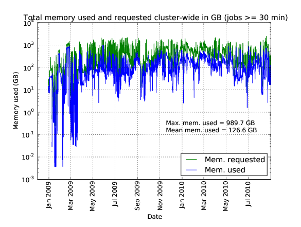
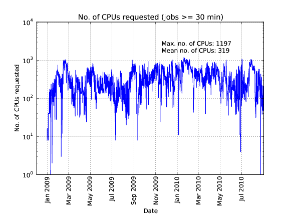
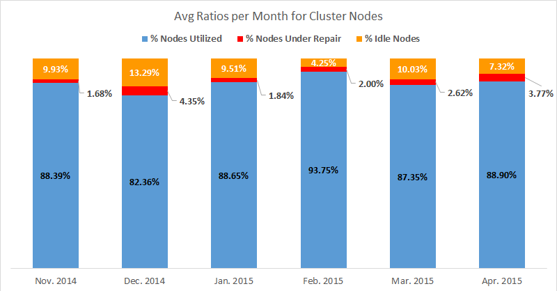
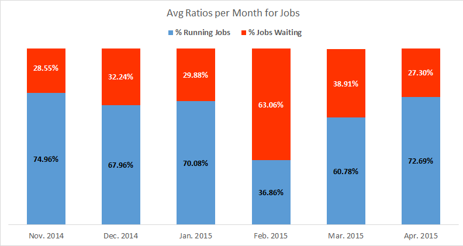
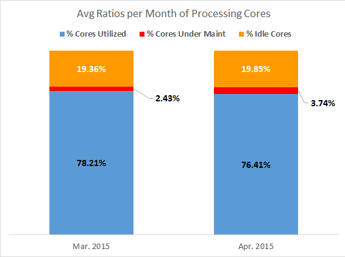
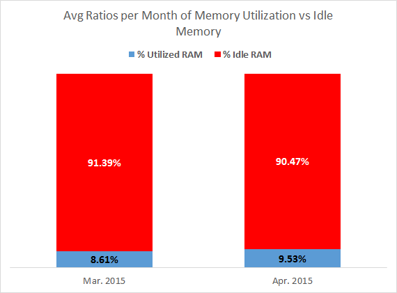

========================
WFU DEAC RepCom Meetings
========================

.. toctree::

.. #############################################################################
.. #############################################################################
.. #############################################################################
.. #############################################################################

----------
2008/11/03
----------

Agenda
======

* David Chin, new systems analyst from Michigan, LIGO, and Brigham's Woman's
  hospital, computational radiation physics, as postdoc.

Changes to Cluster User Policy
==============================

* Tim's showed changes. minor changes made to Representative Committee ("will
  provide a single representative" to "may provide representation")
* added text to make it clear that only WFUHS people are bound by WFUBMC
  policies, and that everyone is bound by WFU CIT policies.

Changes to Cluster Account policy
=================================

* Brought in WFUHS accounts. Made minor corrections. Added Non-disclosure
  requirements.
    
    * everyone has to sign a non-disclosure requirements to disclose any
      confidential information in the event of accidential disclosure.
    * Can be done electronically.
    * If not signed then accounts are disabled.
    * Request to add more reminders to the account termination process; more
      than just 1 reminder.
    * Nodes purchase
    * Plan is 1024 cores with 2GB total.
    * Shutdown of cluster
    * Friday of Dec 5th noon. Intederminate time-length to bring back cluster.

.. #############################################################################
.. #############################################################################
.. #############################################################################
.. #############################################################################

----------
2010/04/05
----------

Attendance
==========

* Rick Matthews
* Lynn Berry
* Tim Miller
* Stacy Howerton
* Bill Kerr
* Natalie Holzwarth
* Greg Cook
* Akbar Salam

Agenda
======

* 32-bit node update
* Storage Remediation Efforts
* Annual Purchase Status

    * Ready to install the hardware after several physical location restrictions
      have been listed.

* Grant Funding Agency Requirements

    * Any security requirements?
    * Any data retention requirements?

* Support Wiki Status

Minutes
=======

Attendees: Natalie Holzwarth, Stacy Howerton, Bill Kerr, Greg Cook, Akbar Salam,
Rick Matthews, Dave Chin, Tim Miller, Lynn Berry

1.  32 bit node retirement update: Two 32 bit head nodes and 7 compute nodes are
    still running. They will remain up until all code can be converted to 64
    bit. The two head nodes will be virtualized.
2.  Storage Remediation: All performance issues appear to be resolved. Tim
    Miller moved the metadata and data to separate drives. The data resides on 6
    dedicated drives and the metadata has 3 dedicated drives. GPFS0 is complete.
    RC1 and RC2 will need to be moved.
3.  Annual Purchase: Hardware has arrived. Power is complete. We're targeting
    April 13/14 for installation. The list of attributes for the new nodes will
    be added to the wiki.
4.  Security: Grant funding agencies are adding requirements for data retention
    and security. Please send an email to Tim Miller, if you encounter these
    requirements.
5.  Support Wiki: Dave Chin demonstrated the new wiki. The link for the wiki is
    `wiki.deac.wfu.edu <https://wiki.deac.wfu.edu/user/Main_Page>`_. Please send
    updates or suggestions to deac-help@wfu.edu. Also, feel free to update the
    pages.

.. #############################################################################
.. #############################################################################
.. #############################################################################
.. #############################################################################

.. _`RepCom meeting`:

----------
2010/09/07
----------

Attendance
==========

Agenda
======

* Review Old Business

    * Virtualization Environment
    * Storage Remediation Status
    * Review 32-bit Node Status

* Operational Changes to Rep Com Meetings

    * Meeting frequency
    * Meeting content
    * Usage of Email instead of meetings? (fixed response time)

* State of the Cluster

Minutes
=======

Old Business
------------

* Virtualization Environment

    * 6 VMware ESXi servers deployed for an approximate "high availability" VM
      environment.

* Storage Remediation Status

    * Progress on reducing/removing ``/gpfs0`` stalled
    * Still storage left to allocate from Spring purchase
    * 15TB of storage is coming from WFUHS

* Review 32-bit Node Status

    * Are these still in use?
    * Can we finish the decommissioning?

New Business
------------

RepCom Operational Changes
```````````````````````````

* Meeting frequency
* Meeting content
* Usage of Email (fixed response time)
* How much integration with IS functional groups is desired?

    * Might need to ask faculty for assistance in filling out IS internal
      business case documents for the initial service requests.

State of the Cluster
````````````````````

* Cluster Usage Reporting




* Review 64-bit Hardware Status

    * 50% of storage nodes are out of warranty next month
    * 100% of head nodes are out of warranty next month
    * 2 clans of dual core nodes are out of warranty
    * 1.5 clans of quad core nodes are out of warranty

* Maintenance tasks/Downtime (nothing pressing yet)

    * Core network switch code update (compute node downtime required)
    * Storage updates (filesystem downtime required, whole cluster preferred)

FY11 Hardware Purchases
```````````````````````

* Cost to upgrade HS21XM with 16GB to 48GB is $6100/blade
* Cost of new HS22 with 48GB is $5800/blade
* Known Computational Needs

    * GPU computing Infrastructure (head node with some GPUs)
    * Test Bed Network Simulation Infrastructure (new chassis needed)

* Known Infrastructure Needs

    * Replacement storage blades
    * Additional storage blades (new WFUHS storage)
    * Second infrastructure chassis ??
    * Globus Grid/SURAgrid infrastructure
    * May need some SAN switch replacement funding
    * 10Gbps connectivity to research networks

Action Items
------------

* Digital Measures - API available to extract publications related to the
  cluster. Expand their functionality on the site to select a "cluster" check
  box.
* Send email to cluster users reminding to correct legacy scripts to remove
  ``gpfs0`` and replace with ``wfurc*``
* Send email to users requesting resource needs as a final chance to provide
  input to purchase needs.
* List of what's getting removed, what's getting added
* Present whole pictures not just deltas

.. #############################################################################
.. #############################################################################
.. #############################################################################
.. #############################################################################

----------
2010/11/01
----------

Attendance
==========

* Tim will attempt to hold this discussion over email. Should the committee
  request an in-person meeting, these "minutes" will be

Agenda
======

* FY11 Cluster Hardware Purchase

* Presentation of Current State
* Presentation of Changes
* Presentation of New State

Virtual Discussion
==================

Cluster Hardware Purchase
-------------------------

Short, short version
````````````````````

* Replace 28 Compute Nodes

    * Remove/retire 8GB blades that have 4 total processing cores and replace
      with 48GB blades having 8 total processing cores.

* Refresh Storage Hardware Device "FASTT1"
    
    * Use WFUHS Enterprise Storage to retire "end of life" storage device.

* Increase maintainability of storage subsystem

    * Purchase IBM v7000 storage device with 24TB of RAW storage

* Refresh Storage Server Blades

    * Replace 8 aging storage blades with 10 new, smaller form factor storage
      blades

Summary
```````

    * As we discussed at previous Rep Comm meetings, we need to increase the
      "per processor" memory on each blade and the most cost effective means of
      doing that is replacing the older "dual core" technology blades with the
      latest "quad core" based blades.
    * We also have some hardware devices that are approaching the point where
      they need replacement (such as the storage blades and one storage device).
      We will leverage some of the free storage from the hospital to assist in
      this replacement effort.
    * However, we'll still need some additional storage for projected increases
      in usage.
    * We've also encountered support issues with two of our newer storage
      devices. There are in essence very few controls or commands that can be
      used to resolve any performance or control issues the devices may be
      having, leaving us no other option than having to power cycle the storage
      device. After discussing the product space with IBM, I've identified a
      potential device (v7000) that could address these issues and at a price
      point that is not significantly higher than our previous storage devices.

Current Cluster State
`````````````````````
See `Cluster: Hardware Configuration`_ for specifics...

* Compute Nodes

    * We currently have 39 blades with 4 total processing cores (i.e. dual core,
      dual processor/socket blades)
    
        * Each of these blades has 8GB of physical RAM
    
    * We currently have 103 blades with 8 total processing cores (i.e. quad
      core, dual processor/socket blades)
    
        * 66 of these blades have 16GB of physical RAM
        * 7 of these blades have 32GB of physical RAM
        * 30 of these blades have 48GB of physical RAM

* Storage

    * 41.9TB of storage online as a GPFS filesystems
    * 675GB of storage held in reserve for ``/home``
    * 5.4TB of storage not in use from Spr 2010 purchase.
    * 15TB "in transit" from the WFUHS Enterprise Storage service.

* Storage Nodes
    
    * 16 Storage Nodes
        
        * Two of these nodes are WFUHS purchased nodes for their storage.

Final Cluster State
```````````````````

* Compute Nodes

    * We currently have 11 blades with 4 total processing cores (i.e. dual core,
      dual processor/socket blades)
    
        * Each of these blades has 8GB of physical RAM
    
    * We currently have 131 blades with 8 total processing cores (i.e. quad
      core, dual processor/socket blades)
    
        * 66 of these blades have 16GB of physical RAM
        * 7 of these blades have 32GB of physical RAM
        * 58 of these blades have 48GB of physical RAM
  
* Storage
  
    * 41.9TB of storage online as a GPFS filesystems
    * 675GB of storage held in reserve for ``/home``
    * 5.4TB of storage not in use from Spr 2010 purchase.
    * 15TB "in transit" from the WFUHS Enterprise Storage service.
    * 18TB (usuable) new storage from Winter 2010 purchase.

* Storage Nodes

    * 18 Storage Nodes

        * 2 nodes dedicated for WFUHS research groups
        * 2 nodes dedicated to WFURC for WFUHS storage

Minutes
=======

.. #############################################################################
.. #############################################################################
.. #############################################################################
.. #############################################################################

----------
2011/04/04
----------

Attendance
==========

* Tim Miller (chair)
* Greg Cook
* Bill Kerr
* Natalie Holzwarth
* Sam Cho
* Stacy Howerton

Agenda
======

* CY2011 Shutdown
* 10Gbps Network Upgrade
* RHEL 6 Upgrade
* New HPC Team Management

Discussion
==========

CY2011 Shutdown
---------------

* Definitely need one

    * 10Gbps Network Changes (required downtime)
    * Storage Device Code Upgrades (required downtime)
    * Network Switch Code Upgrades (required downtime for one switch, optional for two others)
    * GPFS Filesystem Software Upgrades (downtime makes it convenient)

* Proposed date: Aug 29 - Sep 2

10 Gbps Network Upgrade
-----------------------

    * Reviewed what we are planning on doing.
    * Awaiting NC-REN detailed quote.
    * Required WFU hardware purchased and received.
    * 95% chance this will happen.
    * There are connectivity and service availability implications.

RHEL 6 Upgrade
--------------

* We are starting the infrastructure work to support RHEL6 cluster node imaging.
* Goal is to have a development environment by June 1 (very optimistic)
* RHEL4 Support Ends January 2012!
* Core WFU DEAC Software for RHEL6

    * GNU Compilers
    * Portland Compilers
    * Intel Compilers
    * Absoft Compilers
    * GPFS Filesystem
    * OpenMPI/MPICH/MVAPICH (builds, variants, etc. to be determined at project time)
    * Matlab, Maple, Mathematica, ITT IDL
    * BLAS, LAPACK, ATLAS,
    * FFTW 2.x, 3.x
    * (wish list) PETSC

* Software for RHEL6:

    * What software should be centrally supported?
    * What should not?
    * What does "supported" mean?
    * Do we want "SLAs" (or something written somewhere) about the answers to these questions?

* Software licensing, support, and costs we need to be worried about (question for users)?

    * Gaussian?
    * CHARMM
    * LS-DYNA (costs covered by WFUBMC)

* TTD for Tim

    * email users regarding the difficult software licenses/costs
    * Proposal from Greg
 
        * First group does compilation with single compiler
        * Provide explicit instructions on how to build it, how to validate the results
        * We provide secondary compiler support
        * Could send out an email requesting whether someone has started using it

.. #############################################################################
.. #############################################################################
.. #############################################################################
.. #############################################################################

----------
2011/08/08
----------

Attendance
==========

* Tim Miller (chair)

Agenda
======

* Introductions
* Annual Cluster Purchase
* Updates from the Summer

    * CY2011 Shutdown
    * 10Gbps Network Upgrade
    * RHEL 6 Upgrade

Discussion
==========

Annual Cluster Purchase
-----------------------

* Given projected work for fall, deferring annual purchase to the spring.
* Some grant money needs to be spent now (in next couple weeks).

    * Natalie Holzwarth
    * Jacque Fetrow
    * Joel Stitzel (WFU BME)
    * Others?

* What to purchase?

    * Stitzel group will be looking for more Infiniband resources
    * Do we need 96GB nodes?
    * If no specialized needs, will continue hardware refresh plan (replace
      another 14 nodes of 16GB nodes with 48GB nodes)

CY2011 Shutdown
---------------

* Change from April meeting: Date changed to Sep 6-9 (from 8/29-9/2)

    * Lots of hardware firmware updates

        * Storage Device Code Upgrades
        * Network Switch Code Upgrades
        * GPFS Filesystem Software Upgrades (at risk, due to compressed
          timeline)

10 Gbps Network Upgrade
-----------------------

* 100% chance it will happen
* Timeline contingent:

    * University's 10Gbps Internet link upgrades
    * Fiber optic cable route validation

* Ideal to happen during downtime. This is still the goal.
* It is possible to handle the upgrade "live" but connectivity from the cluster
  to campus/internet will have some minor interruptions.

RHEL 6 Upgrade
--------------

* We have made almost zero progress toward a RHEL6 development environment.
* RHEL4 Support Ends January 2012!
* User community will have very limited testing time on RHEL6 environment before
  having to make cutover.
* Software licensing, support, and costs we need to be worried about (question
  for users)?

    * Gaussian - desired version?
    * CHARMM - update from Fred: licensed to a particular research group, not by
      site. Probably not a good candidate for central funding.
    * LS-DYNA (costs covered by WFUBMC)
    * Matlab - Any expected growth in cluster usage? We have licensed DCS now.
      Need to install.
    
        * Tim might submit a capital request for this.

    * Mathematica - now at 30 licenses (still need to load license)

.. #############################################################################
.. #############################################################################
.. #############################################################################
.. #############################################################################

----------
2011/12/15
----------

Attendance
==========

Agenda
======

* RHEL6 Upgrade Status
* User Survey (in preparation)
* FY12 purchase in Winter/Spring
* Narrow choice of meeting dates

Discussion
==========

RHEL 6 Upgrade Status
---------------------

* Research into infrastructure components has begun.
* We will finalize the framework and scope of work in the next two weeks and
  start building out the system image.

User Survey
-----------

* Sent a cluster user "satisfaction" survey to all users on Friday.

    * Goals: Get a quick pulse reading on our efforts. Produce a second survey
      to drill deeper if needed.

* Sent a research group "resource" survey to all users on Friday.
    
    * Goals: Quick gauge on some services we don't offer but other HPC groups
      do. Use the questions to start the creative juices. Facilitate a
      discussion.

FY12 purchase in Winter/Spring
------------------------------

* What to buy?
* Discussion centered around:

    * Current hardware status:
        
        * Estimated 30-40% of the compute nodes are out of warranty (which is
          okay so long as that percentage stays stable)
        * Infiniband hardware in BC01 and BC02 (24-port switch) will no longer
          have hardware support as of Fall 2012
        * We need to retire the 2 DS3000 and 2 DS4000 storage devices to recover
          a significant cost in annual maintenance (frees up for compute node
          purchases)
        * We have one last clan of dual core blades that must be replaced (4
          cores and 8GB on each blade)

    * Tentative needs

        * More storage - Need two more V7000 expansion shelves to replace DS3000
          and DS4000 devices
        * Infiniband refresh - Need minimum of two chassis of new 40Gbps IB
          gear, ideally three.
        * Compute refresh - Need at least one more clan of compute nodes: dual
          socket quad-core (total 8 cores), 96GB blades.

    * Potential needs
        * Infiniband switch to connect the chassis?
        * Third V7000 expansion shelf to add ~18TB of \*new\* storage to the
          cluster


* Memory and processor usage plots were not ready in time for the meeting. Once
  finished and understood, they will be emailed to the committee.

.. #############################################################################
.. #############################################################################
.. #############################################################################
.. #############################################################################

----------
2012/01/17
----------

Attendance
==========

Agenda
======

* User Survey Results
* Cluster Usage Data
* FY12 purchase in Winter/Spring
* ISILON Storage Proof of Concept
* RHEL6 Upgrade Status

Discussion
==========

User Survey Results
-------------------

(*Results are cut-n-pasted as is. For "satisfaction" questions, the percentage
is based on total number of responses. Raw answer count is listed after each
percentage.*)

Please specify the three most significant aspects of the WFU DEAC Cluster that are the most crucial to your regular use of the cluster.
```````````````````````````````````````````````````````````````````````````````````````````````````````````````````````````````````````

* First Most Significant

    1. Available programming languages
    2. space on disk
    3. Fortran 77
    4. Reasonable waiting time in the queue
    5. Inifiniband available
    6. Speed
    7. infiniband (for md simulations)
    8. large number of cores for use in parallel computation
    9. Centralized data storage
    10. Availability of compute nodes to run jobs
    11. Large number of available nodes for running jobs
    12. It is very well maintained and I don't have to worry about anything.

* Second Most Significant

    1. Fair sharing of processor time
    2. memory
    3. Head nodes to do editing and run short programs
    4. Reasonable speed for computer jobs
    5. generally short queue times
    6. Availability
    7. access/cost
    8. infiniband
    9. Large number of CPUs to handle variable demands
    10. Having updated compilers and standard libraries
    11. The cluster is of good size and I can get all my research done.

* Third Most Significant

    1. Significant storage space
    2. up to date libraries
    3. Mathematica
    4. Ease of Use
    5. good availability
    6. Central administration
    7. Having help with computing issues; for example help with compiling code and linking to appropriate libraries.

Please specify the three most significant aspects that are missing in your regular use of the cluster
`````````````````````````````````````````````````````````````````````````````````````````````````````

* First Most Significant

    1. None, I just have cyclical projects
    2. python not up to date
    3. None
    4. Queue status sometime doesn't reflect the real job status. Once, status showed the job was running, and the job was actually hanging there.
    5. limited availability of some resources during peak usage times
    6. SAS program capability (though I know it's coming)
    7. infiniband nodes fill up with jobs not running infiniband
    8. more infiniband nodes
    9. Massive storage space
    10. An easy way to know if the cluster resources for any given job are being used efficiently.
    11. Disk space
    12. The wiki is great, but still need some improvement. I really dislike the fact that you need your password to log in---lots of users use key pairs to log in and don't remember their password (like me).

* Second Most Significant

    1. space on disk for DASP updates
    2. more infiniband nodes for a single job
    3. Support for the latest software
    4. Occasionally it has been hard to get a job through the queue, although it is relatively rare.

* Third Most Significant

    1. more cores per node
    2. It is sometimes hard to compile code and link to installed libraries. While we appreciate Dave's excellent help, perhaps it might be possible to make it easier for us?

Are you satisfied with the overall cluster service you are receiving (hardware resources, resource availability, user support, etc)?
````````````````````````````````````````````````````````````````````````````````````````````````````````````````````````````````````

* Somewhat satisfied 33.3% (4)
* Completely satisfied 66.7% (8)

Are you satisfied with the types of clusters resources made available (Gigabit Ethernet, Infiniband, Types of Storage, Types of Processors, Memory, Intel x86_64 processors, etc)?
``````````````````````````````````````````````````````````````````````````````````````````````````````````````````````````````````````````````````````````````````````````````````

* Somewhat Dissatisfied 8.3% (1)
* Somewhat Satisfied 25.0% (3)
* Completely Satisfied 58.3% (7)
* No Opinion 8.3% (1)

Are you satisfied with the amount of resources available?
`````````````````````````````````````````````````````````
  
* Somewhat Dissatisfied 8.3% (1)
* Somewhat Satisfied 41.7% (5)
* Completely Satisfied 50.0% (6)

Are you satisfied with the user support you receive?
````````````````````````````````````````````````````

* Completely Dissatisfied 8.3% 1
* Somewhat Satisfied 8.3% 1
* Completely Satisfied 83.3% 10

Do you receive timely responses to your support requests?
`````````````````````````````````````````````````````````

* Completely Dissatisfied 8.3% (1)
* Somewhat Satisfied 8.3% (1)
* Completely Satisfied 83.3% (10)

Are the resources provided by the HPC team meeting your research needs?
```````````````````````````````````````````````````````````````````````

* Completely Dissatisfied 8.3% (1)
* Somewhat Satisfied 50.0% (6)
* Completely Satisfied 41.7% (5)

Cluster Usage Data
------------------

Summary
```````

* Average Infiniband Job Wait Time = 2 hr
    
    .. image:: images/2011-12-10_Infiniband_Job_Wait_Times.png

* Average Ethernet Job Wait Time = 20 mins
    
    .. image:: images/2011-12-10_Ethernet_Job_Wait_Times.png

* **Maybe** some better processor utilization after 48GB nodes were added
  (BC07/BC08)
    
    .. image:: images/2011-12-10_Processor_Utilization_Historical_30mBins.png

* **Maybe** some increase in memory utilization too
    
    .. image:: images/2011-12-10_Memory_Utilization_Historical_30mBins.png


Time Ranges
```````````

* entire survey range: 02 Aug 2010 -- 02 Dec 2011
* start of survey to before BC13 was installed (10 Nov 2010)
* between BC13 installation and BC07 installation (01 Mar 2011)
* between BC07 installation and BC14 installation (01 Nov 2011)
* after BC14 installation

FY12 purchase in Winter/Spring
------------------------------

Drivers in the Decision
```````````````````````

    * Suggestions drawn from the survey (for the purchase)
    
        1.  Disk Space
        2.  Infiniband
    
    * Hardware Support
    
        1.  24-port Infiniband switch (end of support = 12/31/2012)
        2.  8 of 14 clans are out of support
    
    * Cluster usage
    
        1.  Infiniband is somewhat of a resource constraint.
        2.  Anecdotal indications are that it will continue to be so.
        3.  Software development is producing more IB capable programs.
    
    * Cost estimates
    
        1.  Disk Space (24TB raw = $28k, ~18TB usable)
        2.  Infiniband (~$18k for each chassis)
        3.  One clan of 96GB Nodes (~$60000)

* Tim's Recommendation

    1.  **Storage** (3 Shelves)
    2.  **Infiniband** (3 Chassis - replacement for 2 chassis, add one new chassis)
    3.  **Clan03** (14 blades)
    4.  Clan05

* Infiniband

    1.  Re-use 24-port switch to interconnect chassis' to determine need for multi-chassis' IB

Future Hardware Issues
----------------------

* Storage Node Remediation

ISILON Proof of Concept
-----------------------

* WFBH testing ISILON NAS device
* Dual connected between WFBH and WFU
* Performance testing now
* Workflow testing in the next week or so
* May opt for much of WFBH provided storage to get migrated to new device

RHEL 6 Upgrade Status
---------------------

* Work on the configuration server underway.
* Pressure is on to get a test environment by February.

.. #############################################################################
.. #############################################################################
.. #############################################################################
.. #############################################################################

----------
2014/05/14
----------

Attendance
==========

* Conducted via Email

Agenda
======

* New staff!
* Cluster Usage Data for RHEL6 (~Summer 2012 until Present)
* Cluster Annual Purchase for Fiscal Year 2014
* Current Cluster Configuration
* Cluster Shutdown for September 2014

Material from Tim
=================

New Staff!!!
------------

Damian Valles
    Joined us in January 2014.

Adam Carlson
    Joined us in late-April 2014.

* They have already been working on your support requests and have been doing a
  great job getting up to speed on the cluster. Please understand that they are
  various levels of familiarity with **our** cluster and our community so some
  extra grace would be appreciated. Please make them feel welcome!
* You can read more information on their backgrounds at our `about page
  <https://is.wfu.edu/deac/about-us/>`_.

Cluster Usage Data for RHEL6
----------------------------

* This information is used to inform the research community on how the cluster
  is being used as a whole.
* We like to have some information regarding which resources are constrained
  (processors or memory) in order to alleviate those bottlenecks.

    * See this :ref:`RepCom meeting` for examples of information we like to
      present.

* **Bad News**: The script used for this task was broken in multiple ways.

    * While I have been able to fix the language specific issues (depracated
      features, e.g.), I have not had the time to successfully convince myself
      that the calculations are accurate.
    * Honestly, had I an inkling of the amount of time required, I would have
      been better off writing it from scratch.
    * **Result**: I do not have any data to present and there is simply no time
      left to generate it.

Simplistic TORQUE Reports
`````````````````````````

* The best I can do is some of the standard TORQUE reporting tools which only
  look at CPU requests and walltimes and have no reporting on memory. You can
  see those reports throughout this document.

Cluster Annual Purchase
-----------------------

* **Good News**: The choice of solution from a financial and performance
  perspective is very suggestive of a best course of action.

+---------------+---------------------------------------+---------+---------------+------------------------+------------+--------------------+--------------+-------------+
| Option Number | Option Description                    | GB/core | Total CPU-GHz | Price per unit CPU-GHz | Total CPUs | Price per unit CPU | Total Blades | Total Price |
+===============+=======================================+=========+===============+========================+============+====================+==============+=============+
| 1             | E5-2697v2 (12core, 2.7GHz), 256GB RAM | 10.67   | 1231.2        | $216.69                | 456        | $585.08            | 19           | $266,794.44 |
+---------------+---------------------------------------+---------+---------------+------------------------+------------+--------------------+--------------+-------------+
| 2             | E5-2660v2 (10core, 2.2GHz), 128GB RAM | 6.4     | 1188          | $197.70                | 540        | $434.94            | 27           | $234,865.83 |
+---------------+---------------------------------------+---------+---------------+------------------------+------------+--------------------+--------------+-------------+
| 3             | E5-2697v2 (12core, 2.7GHz), 128GB RAM | 5.3     | 1231.2        | $211.38                | 456        | $570.74            | 19           | $260,257.11 |
+---------------+---------------------------------------+---------+---------------+------------------------+------------+--------------------+--------------+-------------+
| 4             | E5-2665 (8core, 2.4GHz), 128GB RAM    | 8       | 1036.8        | $269.43                | 432        | $646.64            | 27           | $279,346.87 |
+---------------+---------------------------------------+---------+---------------+------------------------+------------+--------------------+--------------+-------------+

All options include 10GE, one 300GB 10K SAS drive, 3 years 8x5xNBD support

    * Options 1 and 2 leverage pre-configured bundles available from Cisco at
      significant discount levels.
    * Options 3 and 4 are custom configurations and the pricing assumes the same
      pre-approved discount in options 1 and 2. However, we've been told that
      almost certainly wouldn't happen.
    * Options 1, 2, and 3 are Ivy Bridge processors - die-shrink version of
      Sandy Bridge processors (which is option 4)
    * Option 4 is the same configuration we purchased last year.
    * CPU-GHz is merely the number of cores times the clock frequency
    * CPU is number of physical cores (not sockets)

* Option 2, to me, to be the best deal for the funds we have available.

    * Compared to last year's order (using previous processor generation), we
      get 15% more processor cycles at 27% less per cycle cost.
    * Compared to the only other attractive option (option 1), we get 4% less
      processor cycles but by spending 9% less per cycle cost (overall cost
      savings is only 12%).

        * Admittedly, a portion of that difference is less memory per node.

    * Compared to option 3 (which compares the 2660v2 against the 2697v2 at the
      same memory size), we get 4% less processor cycles but by spending 6.5%
      less per cycle cost (overall cost savings is 10%)

* The only other consideration is that while option 1 has higher costs at the
  CPU/blade level, the density allows us to realize savings on the
  infrastructure side (2 chassis instead of 3). That does count for something
  (about $12k).
* Finally, our target available spending amount is about $250,000.00

    * Other options than #2 would require additional funding sources or
      reduction of blades (2 or 3 blades)

Current Cluster Configurations
------------------------------

For some perspective, here is the current cluster configuration:

* **Qty 238 - IBM Blades (8 cores each) - 1904 cores total**

    * 120 Blades with 16GB RAM
    * 28 Blades with 48GB RAM
    * 84 Blades with 96GB RAM
    * 6 Blades with 144GB RAM

* **Qty 29 - Cisco B-series blades (16 cores each) - 464 cores total**

    * Each with 128GB RAM

**Total - 2368 cores (note -The Cisco blades are coming online in the next week)**

Our new cluster configuration (with existing Cisco blades online, and new blades online):

* **Qty 210 - IBM Blades (8 cores each) - 1680 cores total**

    * 92 Blades with 16GB RAM (Retiring 28 old blades)
    * 28 Blades with 48GB RAM
    * 84 Blades with 96GB RAM
    * 6 Blades with 144GB RAM

* **Qty 56 - Cisco B-series blades (128GB RAM each) - 1004 cores total**

    * 29 Blades with 16 cores
    * 27 Blades with 20 cores

**Total - 2684 cores**

* If the power and cooling loads of the new equipment permit, we may be able to
  leave the 2 chassis of old blades online for an additional capacity of 464
  cores.
* However, the older the equipment becomes, the more thought that has to be
  invested into code development, compilation, optimizations, etc. In an attempt
  to reduce operating costs, we may be urged to not keep (5 year old nodes)
  online.
* Please note: no Infiniband blades are affected by this year's purchase plan.

Cluster Shutdown in September 2014
----------------------------------

* Cluster firewalls must be upgraded (annual network refresh). The entire
  cluster network will be down for the activity.
* Would like to reserve the entire week of Labor Day (Tuesday through Sunday) to
  complete the work.

.. #############################################################################
.. #############################################################################
.. #############################################################################
.. #############################################################################

----------
2014/07/01
----------

Attendance
==========

Agenda
======

* Staff introductions
* Overview of Service Issues
* New hardware testing
* September Shutdown
* Policy Matters

Notes
=====

Staff Introductions
-------------------

* Damian Valles
* Adam Carlson

Service Issues
--------------

* Large Queue Backlogs

    * Hardware issues in a couple chassis' in May and early June

* Maui

    * Becoming much less stable than in the past
    * Working on SLURM as replacement

* Large queue backlogs

    * Running at near 100% CPU capacity

* IBM DS3400 storage

    * ``/archive0`` or retire?

New Hardware Coming Online
--------------------------

* FY13 hardware online (16-core SandyBridge processors, 128GB RAM, 10GE)

    * Some performance testing and benchmarking, as well as burn in

* FY14 hardware will be installed beginning with September shutdown

September Shutdown
------------------

* Cluster firewalls being replaced
* GPFS software and kernel upgrades
* BladeCenter Hardware Relocations
* (non-critical path) UCS Hardware Installations
* Potential change to scheduler

Policy Discussion
-----------------

* Gentleman's Agreement/Fair Share

    * Infiniband versus Ethernet versus TenGigabit
    * 2 days for tagging, 4 days for limit

.. #############################################################################
.. #############################################################################
.. #############################################################################
.. #############################################################################

----------
2015/05/05
----------

Attendance
==========

* Tim Miller
* Damian Valles
* Adam Carlson
* Brian Pearce
* Fed Salsbury
* Greg Cook
* Natalie Holzwarth
* Georgia Saylor
* Bill Kerr
* Scott Gayzik

Agenda
======

* Graduation Maintenance Day
* FY15 Annual Purchase
* Performance Data
* SLURM
* State of Cluster
* Upcoming Tasks

Maintenance Day
===============

* **Scheduled: 5/18 - Graduation Day**

    * Reservation starts at 8AM
    * Ends 5/19 at 8AM (not expected)
    * We will send notification when the cluster is available

* **UCS Firmware update**

    * Not on the UCS nodes
    * Purpose: UCS M4 nodes will require the update

* **V7000 Storage**

    * Firmware update:
    * Possible disk firmware update

        * If no jobs are running on the cluster

Performance Data
================

* Data was started to be collected in late October 2014 on Job and Node numbers
* **Average ratios of utilized, idle and under repair cluster nodes for each month**



* **Average ratios of running and waiting cluster jobs for each month**



* Data was started to be collected in early March 2014 on Core and Memory numbers

* **Average ratios of utilized, idle and under repair number of cores for each month**
    
    * March:
    
        * Max Utilized Avg = 95.46%
        * Utilized Avg = 78.21%
    
    * April:
    
        * Max Utilized Avg = 97.05%
        * Requested Avg = 79.38%
        * Utilized Avg = 76.41%



* **Average ratios of utilized and idle of the total memory in cluster for each month**

    * March:

        * Max Utilized Avg = 12.5%
        * Utilized Avg = 8.61%

    * April:

        * Max Utilized Avg = 36.93 %
        * Requested Avg = 26.15%
        * Utilized Avg = 9.53%



FY15 Annual Purchase
====================

General Approach
----------------

* Primary focus on purchases is core count, not memory
* Still maintaining a UCS standard memory configuration of 128GB

    * All UCS nodes are capable of at least 384GB

General Funding Status
----------------------

* No external grant funding identified.
* Changes at WFBH required us to purchase $11k in storage (16TB raw)
* GPFS licensing changes reduced maintenance budget surplus
* Would greatly appreciate any supplemental department, startup, or indirect funding

Proposed Configuration
----------------------

* 2 Chassis, 16 blades total
* 512 total cores (Dual Intel E5-2698 v3 processors, 2.30 GHz, 16-cores/processor)
* 2TB RAM total (128GB/blade on 16 blades)
* 300GB/blade (SSD drives *almost* cheap enough)
* 20GE/blade network connectivity, 40GE/chassis

    * Will reduce two original chassis from 40GE/chassis to 20GE/chassis

* Received an extra 10% in discounting from Cisco in order to meet the budget
  target and fill out the chassis.

SLURM
=====

:download:`Final paper <files/SLURM_repcom_final.pdf>`

State of the Cluster
====================

* **New ARCHIVE Space**

    * EMC VNX 5600
    * On the headnodes: /archive1
    * 16TB - Raw
    * 12TB - Usable

* **UCS Additional Nodes**

    * Chassis: two nodes in 5; full 6, 7, 8
    * Total 540 cores; 20 per node

* **OFFLINED Nodes**

    * BC13BL14 - Bad Hard Drive (Out of Warranty)
    * BC14BL11 - Bad Memory DIMM (Out of Warranty)

* **Decommisioned**

    * DS3400 Storage Array
    * BC08BL05 - Bad Hard Drive (Out of Warranty)
    * BCG01 Nodes
    * BCG03 Nodes

* **Out of Warranty**

    * BC03 Nodes 4/20/15
    * BC06 Nodes 4/20/15

* **Upcoming IBM Expirations**

    * RHEL6HEAD1 6/30/15
    * RHEL6HEAD2 6/30/15
    * RHEL6HEAD3 6/30/15
    * BC05 Nodes 8/2/15
    * BC101BL02 9/5/15
    * BC101BL13 9/5/15
    * BC102BL02 9/5/15
    * BC102BL13 9/5/15
    * BC09[BL09-BL14] 1/6/16

Upcoming Tasks
==============

* RHEL7 upgrade to head and compute nodes

    * GPFS is now supported on RHEL7
    * Testing and collaboration for

        * Compiling software
        * Software installation options
        * Software operation
        * Software versions

    * RHEL4 tools still required??

.. #############################################################################
.. #############################################################################
.. #############################################################################
.. #############################################################################

----------
2015/10/27
----------

Attendance
==========

* Brian Pearce - IS
* Adam Carlson - IS
* Damian Valles - IS
* Rosey Murton - Procurement
* Laura Jane Kist - Procurement
* Natalie Holzwarth - Physics
* Lucho Dimitrov - Human Genomics
* Greg Cook - Physics
* Gloria Stickney - Physics
* Rebecca Alexander - Chemistry
* Gloria Muday - Biology

Agenda
======

* State of the Cluster
* Federal Grants - New Uniform Guidance
* FY16 Purchase / HPC Storage array
* Moving forward: New Vision of HPC
* SLURM
* Upcoming Tasks

State of the Cluster
====================

Twitter
-------

* We now have a Twitter handle: `@WakeHPC <https://twitter.com/WakeHPC>`_
* We are using this account for:

      * Another way to broadcast any upcoming maintenance, additions, faculty
        announcements, etc.
      * Connecting with other HPC shops in schools and labs
      * Connecting with HPC hardware/software suppliers

New DEAC Design
---------------

* We decided that the `website <http://www.deac.wfu.edu>`_ needed more
  flexibility

    * Multi-device friendly
    * Auto-fill "Request Account" / "Request Software" pages

* Please continue to provide (or have students do this) the list of
  publications, thesis, presentations, etc.

Cluster Stats
-------------

* As of October 19, 2015

    * Number of Nodes
        
        * IBM Nodes = 194
        
            * SLURM IBM Nodes = 17
        
        * UCS Nodes = 72
        
            * SLURM UCS Nodes = 16
    
        * GPU Nodes = 5
        * Total Nodes = **271**

    * Number of x86 Cores = **3128**
    * Number of GPU Cores = **8960**
    * Total RAM = 20227778236 KB or **~2TB**

File Systems
------------

* Recently we utilized an EMC-tool to scan our utilization of the cluster
* Key Observations:

    * 86% of files (46,907 GB) have **not changed in 6+ months**
    * 82% of files (43,576 GB) have **not changed in 1+ years**
    * 84% of files (42,819 GB) were **not accessed in 6+ months**
    * 91% the storage (47,720 GB) was consumed by **files larger than 10 MB**

* File Consumption

    .. image:: images/File-consumption.png

* Number of Files in each File system (5.5TB/file system)

    .. image:: images/File-numbers.png

Performance Data
----------------

* **Job and Node** numbers last 12 months

    * **Average ratios of utilized, idle and repair/testing cluster nodes for each month**

        * Avg of Utilized Nodes = 88.23%
        * Avg of Test/Repair Nodes = 2.71%
        * Avg of Idle Nodes= 9.05%

    .. image:: images/NodesOCT2015.png

    * **Average ratios of running and waiting cluster jobs for each month**

        * Avg of Running Jobs = 63.89%
        * Avg of Waiting Jobs = 36.65%

    .. image:: images/JobsOCT2015.png

* Data since March 2015 to October 2015 on **Core and Memory** numbers

    * **Average ratios of utilized, idle and repair/test number of cores for
      each month**

        * Max Utilized Avg = 100% (Twice - June & July)
        * Requested Avg = 79.13%
        * Utilized Avg = 75.26%

    .. image:: images/CoresOCT2015.png

    * **Average ratios of utilized and idle of the total memory in cluster for
      each month**

        * Max Utilized Avg = 17.25% (October)
        * Requested Avg = 26.43%
        * Utilized Avg = 8.31%

    .. image:: images/MemoryOCT2015.png

Federal Grants - New Uniform Guidance
=====================================

* New rules are applied starting: **7-1-2016**
* This is what we know so far...

    * If the a grant was signed **after December 26, 2014**... subject to new
      audit provisions

        * Anything prior to that is grandfathered in
        * Overarching principles still apply, costs must be allowable,
          allocable, and reasonable

    * **Charging of Computer Devices**

        * If costs <$5K, its allowable for direct costs, then must be essential
          and allocable
        * If over $5K, purchase must be classified as capital equipment

    * **Procurement** (starting next FY)

        * **\< $3K** - No documentation required for micro purchases
        * **$3K-$150K** - Evidence of 2 quotes or use of strategic sourced vendor

            * Which ever is *"most restrictive"* (government or WFU)
            * WFU does NOT allow internet quotes

        * Additional requirements for larger $$$ thresholds

* WFU will continue to monitor federal activity

    * Could be changed or delayed before next summer.

* WFU working to ensure that implementation of the guidance provides fast and
  easy procurement of needed research materials and equipment, while ensuring
  compliance.
* Need to keep in mind *"restricted vendors"*

FY16 Annual Purchase
====================

General Approach
----------------

* Primary focus on purchases is core count, will consider higher memory if price
  is right.
* Still maintaining a UCS standard memory configuration of 128GB, the jump can
  be to 256GB

    * All UCS nodes are capable of at least 1,536GB - (B200 M4)

* Because of the Uniform Guidance:

    * Start applying our purchases starting this FY with Uniform Guidance format
    * Since we have Cisco UCS -\> reach out vendors with RFQs
    * This will give us past-purchase equipment in the cluster for next FY

General Funding Status
----------------------

* Three grant funding identified so far this FY (THANK YOU!)
* Lori Messer - OSPR will continue to provide cost matching and in the future
* Would greatly appreciate any supplemental department, startup, or indirect
  funding
* We have submitted a 5-year budget exercise to IS - Hoping for increase in
  budget

Proposed Configuration
----------------------

* Two purchases will be made
    
    * **First purchase**: spending contribution from Med School

        * 1 Chassis, 5 blades (+ 3 blades already purchased through grants)

    * **Second purchase**:

        * Bundle: Single Chassis + 8 blades
* Overall:
    
    * 2 Chassis, 16 blades total
    * 512 total cores (Dual Intel E5-2698 v3 processors, 2.30 GHz, 16-cores/processor)
    * This will put us:

        * 2028 UCS cores + 1552 IBM cores = **3580 Total Cores**
        * **2.2TB** RAM total (128GB/blade on 16 blades) or **2.4TB** RAM (256GB/blade)

    * 300GB/blade
    * 20GE/blade network connectivity, 40GE/chassis

        * Will reduce two original chassis from 40GE/chassis to 20GE/chassis

New HPC Storage Array Solution
------------------------------

* Our current storage array is old (tech years) -- **5th year of operation!!**
* Coming out-of-warranty at the end of December 2015
* Started process for new purchase for storage array

    * Issued Request for Proposal to **EMC, NetApp & Dell**
    * Had a pre-bid conference call with all vendors
    * They have submitted questions & we have responded
    * Vendors have submitted Proposals
    * Invited for presentations
    * We expect to make decision on the equipment next week
    * Turn around time in late-November

* The equipment will be purchase through a lease-to-own

    * Mur Muchane (CIO) needs to approve it
    * Hof Milan might need to approve it

* Worst case: we would have to extend maintenance cost

Moving Forward
==============

* How will Wake look like in 5-10 years from now?

    * Through President Hatch's address earlier this month, there will be a
      **push for STEM** for Wake
    * Through Campus Connections, Dean Michele Gillespie, **Innovation Quarter**
      is moving forward for stronger collaboration with Hospital
    * Our point-of-view: How, then, HPC can help complement this mission?

        * The mission will (should) not change, but the services will have to
          expand in order to reach High Performance Research

* How will HPC help to leverage the computational needs in the future?

* HPC is following a trend that will change in:

    * Interaction. Web-based interface portals, cloud-component utilities.
      **Cluster for the "99"% approach**.
    * Data. Less amount of data transfers to perform **HPC+Big
      Data+Visualization** all in the same infrastructure
    * Code. OpenACC-approach to **run on GPUs** -> #pragma or #directive
      approach to speed up execution.

* What services will be needed to support ALL research with computational
  components?

    * No matter what direction, the same computation approach **will stay the
      same**
    * **GPUs+Nodes**: Many clusters have a subset of GPU-nodes, we can have a
      3-5 year roll out of NVIDIA Nodes

        * Cisco people are curious in how Wake could use UCS nodes + GPUs

* What kind of infrastructure will be needed to provide such services?

    * GPUs or any accelerator?
    * Composable Infrastructure?

        * Multi-use or **Reconfigurable** hardware
        * Visualization or big data or HPC cycles
  
    * Hybrid cluster: HPC/Hadoop?

        * Logic-level of doing both **HPC+Big Data** computation
        * Brightcomputing
  
    * Need cloud component to HPC?

        * Mainly **Archive or Backup** solution
        * Primary storage will still be hosted with cluster

    * **In situ visualization** software?

        * Data transfers are expensive
        * No need to move data from cluster and be able to Visualize it with
          same hardware

    * Require **development effort** to reach goals?

        * We can provide support in code to reach new vision

    * Do we need a **DR solution** as well?

        * We currently do not have a Disaster Recovery solution
        * Have a subset of cluster back in campus?

* **By Utilization Numbers**

    * **Last 8 months** = 3/4 of the cluster's cores are used on AVERAGE
    * Roll IBM out NODES -\> Increase UCS hardware for computer & other services
      as well

        * We continue to keep the same (and increase) core-count due to density

* **Brainstorming**

    * Have smaller meetings through the rest of the year
    * Give opportunity for everyone to bring ideas

SLURM
=====

:download:`Presentation <files/SLURM_repcom_2015.10.27.pdf>`

Upcoming Tasks
==============

* SLURM
* New storage migration
* File system migration GPFS to NSF (Lustre File Sytem?)
* Ganglia
* Possible SVN replacement

.. #############################################################################
.. #############################################################################
.. #############################################################################
.. #############################################################################

----------
2016/05/10
----------

Attendance
==========

* Adam Carlson
* Brian Pearce
* Damian Valles
* Gloria Stickney
* Greg Cook
* Richard Williams
* Natalie Holzwarth
* Sam Cho
* Timo Thonhauser
* James Gaewsky

Agenda
======

* State of the Cluster
* FY16/FY17 Hardware Purchase
* Updates: New Storage & SLURM
* New HEAD-NODES
* O.S. Upgrade on DEAC
* School of Business
* Upcoming Tasks

State of the Cluster
====================

YouTube
-------

* We have a YouTube Channel
* The idea behind this: Training Videos

    * Very useful with SLURM
    * Very userful with new users

* This will have the flip-class approach
* **YouTube search: DEAC Cluster**
* If you have an idea of video(s) for us to have, we are open to suggestions

Cluster Stats
-------------

* **As of May 2, 2016**

    * Number of Nodes = **271**

        * IBM Nodes = 194

            * TORQUE IBM Nodes = 55
            * SLURM IBM Nodes = 139

        * UCS Nodes = 72

            * TORQUE UCS Nodes = 16
            * SLURM UCS Nodes = 56

        * GPU Nodes = 5

    * Number of x86 Cores = **3128**
    * Number of GPU Cores = **8960**
    * Total RAM = 24817555920 KB or **24TB**

Performance Data
----------------

  - **Job and Node** numbers last 12 months

> **Average ratios of utilized, idle and repair/testing cluster nodes
> for each month**
>
>   - Avg of Utilized Nodes = 77.96%
>   - Avg of Test/Repair Nodes = 5.87%
>   - Avg of Idle Nodes= 16.16%
>
> <!-- end list -->
>
>   -
>     
>
> **Average ratios of running and waiting cluster jobs for each month**
>
>   - Avg of Running Jobs = 49.06%
>   - Avg of Waiting Jobs = 50.92%
>
> <!-- end list -->
>
>   -
>     

  - **Core and Memory** numbers last 12 months

> **Average ratios of utilized, idle and repair/test number of cores for
> each month**
>
>   - Max Utilized Avg = 94.46%
>   - Requested Avg = 77.5%
>   - Utilized Avg = 65.73%
>
> <!-- end list -->
>
>   -
>     
>
> **Average ratios of utilized and idle of the total memory in cluster
> for each month**
>
>   - Max Utilized Avg = 15.94%
>   - Requested Avg = 28.67%
>   - Utilized Avg = 7.97%
>
> <!-- end list -->
>
>   -
>     

# FY16/FY17 Annual Purchase

  - **FY16 Purchase**

<!-- end list -->

  - Big year of contributions: **$94,778**

:\* Not counting ORSP match

  - We are still accepting all kinds of contribution

<!-- end list -->

  - Options that we need to submit for final FY purchase:

:\* **Option \#1:** Nodes + GPU expansion + Data & Archive storage

::\* 1 Chassis, 8 nodes, 1 GPU node, 6 GPU expansion cards

:::\* 384 Cores

:::\* 10,752 GPU Cores

::\* 31TB Data Space expansion

::\* 12TB Archive expansion

::\* **Total = $173,206.40**

:::\* $/Core = $292.73

:::\* $/GPU core = $2.78

:::\* $/GB of storage = $0.64

:\* **Option \#2:** Nodes + GPU expansions, No storage

::\* 2 Chassis, 10 nodes, 1 GPU node, 6 GPU expansion cards

:::\* 472 Cores

:::\* 10,752 GPU Cores

::\* **Total = $176,543.81**

:::\* $/Core = $291.08

:::\* $/GPU core = $2.78

:\* **Option \#3:** Nodes + Single-GPU node, No storage

::\* 2 chassis, 12 nodes, 1 GPU node

:::\* 560 Cores

:::\* 1,536 GPU Cores

::\* **Total = $175,897.59**

:::\* $/Core = $289.95

:::\* $/GPU core = $1.29

:\* **Option \#4:** Option 3 + Data & Archive Storage

::\* 2 chassis, 10 nodes, 1 GPU node

:::\* 472 Cores

:::\* 1,536 GPU Cores

::\* 31TB Data Space expansion

::\* 12TB Archive expansion

::\* **Total = $178,356.18**

:::\* $/Core = $291.08

:::\* $/GPU core = $2.78

:::\* $/GB of storage = $0.64

## Summary

    • Timo
      * Preference to hold off on GPU
      * Wait for GPU to gain in popularity
      * Focus on Compute in the meantime
      * Turn on thin provisioning
      * Storage discussion
        * Timo’s group maintains a small quota by deleting old files

    • Sam
      * Agreed on holding off on GPU
      * New GPU architecture came out in March
        * Supposed to be much more efficient
      * Focus on compute and storage
      * Storage discussion
        * Molecular dynamics take up so much space to keep entire trajectory
        * Easier to use external hard drive to share data versus sending electronically

    • Natalie
      * Good with additional CPU capabilities
      * Understands the storage needs

    • Greg
      * With new faculty coming in
      * Already have storage there
      * Estimate for current consumption versus allocated
      * Plan for storage growth

    • Purchase Decision: Option #4

    GPU desktop pilot:
    • Investigate integrating some of Sam’s GPU desktops into the cluster
    • HPC can help admin

  - **FY17 Purchase**

:\* It has been recommend to us by the Procurement Office make two
purchases each year instead of one large purchase order

:\* We will try to try the split approach next school year.

::\* **Buying more robust servers to run the head-nodes**

:\* We will email out the purchasing items in the Fall

:\* We are considering: *' Memory Nodes*'

::\* Nodes would have close to 1TB of RAM

::\* Would have their own partition in SLURM

::\* Ideal cases for any large / huge data sets

::\* Save resources from the rest of the group

:\* **Continuing to buy HPC nodes**

## Summary

    * Greg likes the idea of such resources available
      * Recommends a lower time limit for memory node usage outside of its partitions
    * Natalie wants more info about the various nodes
    * We would schedule a different partition or queue for such Memory Nodes

# Updates: New Storage & SLURM

  - **Storage**

:\* Just over **109TB of storage space** vs 70TB of old array

:\* New paths:

::\* **/deac/opt** ---\> for our binary files

::\* **/deac/generalGrp/*researchGrp*** ----\> for all general group
users

::\* **/deac/*researchGrp*** ----\> for all contributing research groups

::\* **/isilon** ----\> for hospital users, own storage array

  -
    vs
    :\* /rhel6/opt or /rhel4/opt
    :\* /wfurc*\#*/generalGrp
    :\* /wfurc*\#*/researchGrp
    :\* /wfuhs*\#*/researchGrp

<!-- end list -->

  - **SLURM**

:\* **86.95%** of Chassis have been converted

:\* **May 15, 2016** will be the last day for PBS Torque Jobs

:\* We have created documentation on our Wiki

:\* We have created videos on our YouTube Channel

:\* **Last Minute last week**

::\* Transformed rhel6head1, rhel6head2 & rhel6head3 to **hybrid
PBS-SLURM head-nodes**

::\* Running low in system resources on rhel6head4

## Summary

    * At this point, all the nodes are in the SLURM scheduler
    * Also, all research groups and users should be using the new paths from the new storage array.

# New Head-Nodes

  - **Current State of Head-Nodes**
      - Torque Head-Nodes = 3
      - SLURM Head-Nodes = 1

<!-- end list -->

  - **Hardware Specs**
      - rhel6head1, rhel6head2, rhel6head3: TORQUE Head-Node
          - Cores = 16 each
          - RAM = 96GB each
          - Disk = 146GB each
      - rhel6head 4: SLURM Head-Node
          - Cores = 8
          - RAM = 16GB
          - Disk = 73.4GB

<!-- end list -->

  - **Hardware of the Headnodes**
      - rhel6head1 (bc103bl05): Quarterly Maintained, +5yo
      - rhel6head2 (bc103bl06): Quarterly Maintained, +5yo
      - rhel6head3 (bc103bl09): Quarterly Maintained, +5yo
      - rhel6head4 (bc103bl14): Quarterly Maintained, +5yo

<!-- end list -->

  - **Going Forward:**
      - Instead of having them transformed as SLURM head-nodes ---\>
        Stop paying for maintenance
      - Decommission the old hardware
      - Transform the head-nodes to reside as virtual-systems
      - Reduce number back down to 3 Head-Nodes
      - Rename the head-nodes ----\> Something more practical

## Summary

    * Timo asked about why virtual
        * Explained admin benefits
        * vMotion Head-nodes in case hardware goes bad and not have downtime
    * Shouldn’t notice a difference
        * All users can connect to a single point in which then it will be tokenized to another head-node.
        * This in effect relieve traffic on the head-nodes
        * User will and should be able to connect to specific head-nodes if necessary
        * New head-nodes will have different names from the current ones
    * Would like to be an upgrade to what we have at least
        * HPC team explained the configurations of the new virtual head-nodes
        * They would have to be at least the same hardware configurations of current nodes
        * Possibly buying extra RAM in order to host the new head-nodes

# OS Upgrade on DEAC

  - **Current challenges**

:\* Cannot install latest versions of applications

:\* Latest MPI compilers work best on new OS

:\* There's a cost to our current OS

  - **Proposal**

:\* Move to **CentOS 7** vs RHEL 7

::\* Same commands, same environment

::\* OS is free

::\* Easier to upgrade or install new version of applications

:\* Upgrade **OpenMPI** to the latest version

::\* Version **1.10** vs current 1.6

::\* Better optimization through new MPI libraries ---\> better
bare-metal performance

:\* **Ripple Effect**

::\* Upgrade FFTW libraries

::\* Upgrade SCALAPACK & BLAS libraries

::\* Quad-precision compilers/libs (in case 15 decimal-point values
won't do)

  - **Timetable**

:\* TBD for HPC

  - **We need feedback**

:\* What was the experience as a user when Admins changed OS versions?

:\* Long time for changes to take place? Short turn around?

:\* What was the state of the applications? Recompiled?

:\* Testing head-node available? test nodes?

## Summary

    * Talking about phased approach --- like it was done for SLURM
    * Use a partition or separate defined cluster
    * HPC team does not use RHEL support
        * No need to keep RHEL with GPFS now gone
    * Greg likes the newer package availability
    * Damian is having problems installing new versions of applications due to the our current Operating System
    * GNU compilers are awfully darn good
    * Decision: MOVE FORWARD WITH CENTOS7
        * Was informed they would like to see if happen FAST

# School of Business

  - New Graduate Program: MSBA - **MS Business Analytics**
  - Starts this Summer - July 2016
  - Continuing to hire Faculty for the program
  - 3rd-year projection: **120 students**
  - Need infrastructure: **HPC + Big Data + (Storage)**

:\* Current needs: Just HPC, but Big Data will be needed

:\* They have a space problem

:\* They approached us for help

  - **Big Data Research**

:\* Bright Computing - Logical level to use same equipment solution

:\* Amazon - Amazon has approached us as a cloud solution

:\* Dell - Ready to go out of the box solution

  - **Going forward**

:\* School of Business will begin to contribute to the HPC
infrastructure

## Summary

    * Can they be put on a separate cluster or queue?
    * Possible concerns:
         * Worried about School of Business doesn’t need much, then no not much, no no no, THEY NEED EVERYTHING.
         * Time the HPC administrators would spend supporting them and not HPC operations
         * Keep physical hardware separate, on storage and compute, and keep hours spent separate
    * TO DO: investigate and discuss a separate queue just for the School of Business

# Upcoming Tasks

  - Finish SLURM transition
  - Finish FY16 purchase
  - New HEAD-Nodes
  - Assessment of Bright Computing
  - O.S. Upgrade
  - Decommission of RHEL5 servers

[Category:WFU DEAC Repcom
Meetings](Category:WFU_DEAC_Repcom_Meetings "wikilink")


----------
2016/10/14
----------

# Attendance

  - Damian Valles
  - Adam Carlson
  - Jane Ridge
  - Allin Cottrell
  - Staci Hepler
  - Greg Cook
  - Natalie Holzwarth

# Agenda

  - State of the Cluster
  - Admin's Laundry List
  - New Funding
  - New HEAD-NODES
  - FY17: Fall 2016 Hardware Purchase
  - Backup/DR Solutions
  - School of Business
  - Upcoming Tasks

# State of the Cluster

  - This part of the agenda will not be covered during the meeting. This
    section is to show the utilization of the cluster in the last 12
    months.

## Cluster Stats

  - **As of Oct 1, 2016**

>   - Number of Compute-Nodes = **291**
>       - IBM Nodes = 194
>       - UCS Nodes = 90
>       - GPU Nodes = 7

>   - Number of x86 Cores = **3,824**
>   - Number of GPU Cores = **12,032**
>   - Total RAM = **26.5TB**

## Performance Data

  - **Job and Node** numbers last 12 months

> **Average ratios of utilized, idle and repair/testing cluster nodes
> for each month**
>
>   - Avg of Utilized Nodes = 72.68% (Dropped – More targets to UCS over
>     IBM Nodes)
>   - Avg of Test/Repair Nodes = 3.96%
>   - Avg of Idle Nodes= 23.36%
>
> <!-- end list -->
>
>   -
>     
>
> **Average ratios of running and waiting cluster jobs for each month**
>
>   - Avg of Running Jobs = 39.12%
>   - Avg of Waiting Jobs = 60.88% (Wait times have increased)
>
> <!-- end list -->
>
>   -
>     

  - **Core and Memory** numbers last 12 months

> **Average ratios of utilized, idle and repair/test number of cores for
> each month**
>
>   - Max Utilized Avg = 90.34%
>   - Requested Avg = 67.4%
>   - Utilized Avg = 57.41% (Finals/Graduation- research took a break)
>
> <!-- end list -->
>
>   -
>     
>
> **Average ratios of utilized and idle of the total memory in cluster
> for each month**
>
>   - Max Utilized Avg = 12.68%
>   - Requested Avg = 30.48%
>   - Utilized Avg = 5.78% (We never use RAM – True definition of HPC)
>
> <!-- end list -->
>
>   -
>     

## Storage Stats

  - **As of Oct 4, 2016**

>   - **Research Data on DEAC**
>       - Total Storage Space = **118.56TB**
>       - Used Space = **52.85TB**
>       - % of Utilized Space = **44.57%**
>       - Dedup/Compression Savings = **6.4TB**

  -
    

>   - **Archived Data on DEAC**
>       - Total Storage Space = **20TB**
>       - Used Space = **8TB**
>       - % of Utilized Space = **40%**
>       - Dedup/Compression Savings = **1.9TB**

  -
    

# Admin's Laundry List

  - RHEL 5 System Retirement

:\* SVN

:\* User wiki

:\* DEAC website

:\* LS-Dyna license server

  - SLURM partition priority change

:\* Lower partition multiplier to make equal to
    fairshare

    ----> RHEL 5 Management servers will be discontinued by RedHat by the end of April 2017
    ----> SVN will go away and introduce GIT for the Subversion control in the cluster
    ----> The WIKI will go through a big upgrade and will be hosted on a different server, same URL
    ----> The DEAC site will not be hosted by HPC, it will be moved the I.S. services, same URL
    ----> LS-Dyna license server will have a new operating system, e.g. a new license will be needed
    ----> SLURM:
    *** Changes to the partition weights will be changed to match FAIRSHARE values
    *** Incident over the summer in where user had zero-fairshare and yet took over small-partition
    *** Possible new partition for the older non-infiniband IBM nodes: bigger priority when users do not require performance

# New Funding

  - HPC Received **$278,000**
  - Funding was received due to the feedback received from the **IT
    Planning Faculty Discussion Group** back in **Nov. 2015**
  - Funds do **NOT** expire at the end of the Fiscal Year.

<!-- end list -->

    ----> This is a one-time fund
    ----> We can utilize funds for more hardware (compute/storage/network), software and/or licenses that will be needed
    ----> Need to compile list of items that the funds will be utilized for purchasing

# New Head-Nodes

  - Four head-nodes:
      - **orion**.deac.wfu.edu --\> Round Robin Server
      - **hydra**.deac.wfu.edu
      - **virgo**.deac.wfu.edu
      - **libra**.deac.wfu.edu

<!-- end list -->

  - Currently ready for use in testing, but not going full production
    until new ESX servers in
    place.

<!-- end list -->

    ----> New suggested head-node names: short, simple, and easy to remember
    ----> ORION will be the connection point to the cluster, not necessary a head-node
    ----> Users will have the ability to access an individual head-node when necessary
    ----> Goal: getting rid-off the numerical naming as many connect to #1 head-node

# FY17: Fall 2016 Purchase

Changing to two primary purchases in the year, to lower overhead of one
large purchase. Allows us to purchase immediate needs at beginning of
the year.

  - 6 new Compute Nodes (a1a-u2-c15-b\[3-8\])

:\* 44-core broadwell

:\* 256GB RAM

:\* 250GB /scratch

  - 2 new ESX servers

:\* 44-core broadwell

:\* 512GB RAM

  - **Total: ~$100K**

The new ESX servers will better accommodate our new head nodes.
Additionally, upcoming tasks will grow our virtual environment, and
allow us to replace legacy systems/services.

    ----> Purchase is approved
    ----> The new head-nodes will be in the new ESX servers
    ----> Greg proposed instead of buying more hard drives, just keep buying new head-nodes and fall under new scratch partition as a possible cost savings
    ----> Natalie would like to have a table/diagram of all possible constraints for the cluster.  Damian will document such table/diagram.

# Backup/DR Solutions

  - **NetApp Cloud ONTAP**

:\* Assumptions for 105TBs of data with 30% dedupe/compression ratio

:\* Low Performance: **$25,891.00/year** Monthly GB cost: $0.02

:\* Regular Performance: **$43,260/year** Monthly GB cost: $0.03

  - **Cost of a secondary onsite storage array**

:\* Assuming a secondary FAS8040 unit with equivalent storage to today-
**$42,767.60/year**

  - **Costs of Backup today** (Enterprise budget absorbs costs at this
    time)

:\* PVU Costs: $2,112/year

:\* Tape & Tape Library Support Costs: $25,763/year (tape is $0.17/GB -
I have taken out TSM costs)

:\* Assuming 148TBs of data footprint - today HPC has 148TB footprint
with copy pools so this number is higher than the amount of data in
storage

:\* Total:
    **$27,875/year**

    ----> Since the Enterprise side of I.S. is moving away from TSM, we need to consider our HPC Backup solution
    ----> Jane Ridge, Storage Administrator at Wake, presented current and possible solutions
    ----> The vote:  NetApp Cloud ONTAP on AWS will be implemented
    ----> Time frame: This will be implemented within 1-1.5 years from now

# School of Business

  - The MSBA Program has contributed to the HPC cluster
  - They have approved contribution to the HPC cluster for the next **5
    years**
      - **$19,352.60 / year**
  - Class work at this point

<!-- end list -->

    ---> This is the buy-in for the School of Business
    ---> Their contributions are for own dedicated HPC node(s)
    ---> The will have their own SLURM account/partition, aside from the rest of campus
    ---> The MSBA program will eventually has to part away from HPC nodes and move to Hadoop solution

# Upcoming Tasks

  - Tengig system improvements:

:\* Reduce latency by 25%

:\* GPU testing

  - Hadoop Investigation
  - Active historical job monitoring, cluster usage test pilot
  - Strategic Plan Impacts

:\* Data Center migration (long term Strategic Plan)

:\*
    Governance

    ----> Adam is working with CISCO in order to reduce network latency for UCS "tengig" nodes
    ----> Also working with CISCO in providing us with new firmware for GPU utilization (M6-NVIDIA)
    ----> We received Proof-of-Concept hardware from CISCO to test, we will utilize it for possible Hadoop implementation
    ----> Monitoring program: Graphite, possible programming tool for HPC team and all DEAC users
    ----> Plans to move the DEAC cluster back to campus:
    *** Meetings with the Network team will begin this week
    *** In order to always have a cluster, we will be rolling-transfer equipment from downtown to campus
    *** This will require a second DEAC cluster a we transition
    *** Main goal:  ALWAYS HAVE A RUNNING CLUSTER
    ----> Governance
    *** New governance strategy from I.S. affects Repcom
    *** At some point, we will have a representative to explain the changes

[Category:WFU DEAC Repcom
Meetings](Category:WFU_DEAC_Repcom_Meetings "wikilink")


----------
2017/05/12
----------

# Attendance

1.  Samuel Cho (comp sci / physics)
2.  Jeremy Schap (wfhs)
3.  William Turkett (comp sci / bioinformatics)
4.  Mark Curtis (economics)
5.  Greg Cook (physics)
6.  Grey Ballard (comp sci)
7.  John Bowers
8.  Odi Iancu
9.  Rob Smith
10. Damian Valles
11. Adam Carlson

# Agenda

  - Call to order
  - Introduction to Odi and Rob, rest of introductions
  - State of the Cluster
  - Intro and discussion over the new IT Governance Strategy
  - Review of Spring Purchase
  - IBM BladeCenter Replacement Plan
  - Upcoming Task
  - Further feedback and Q\&A

# State of the Cluster

  - This part of the agenda will not be covered during the meeting. This
    section is to show the utilization of the cluster in the last 12
    months.

## Cluster Stats

  - **As of May 12, 2017**

>   - Number of Compute-Nodes = **295**
>       - IBM Nodes = 194
>       - UCS Nodes = 94
>       - GPU Nodes = 7

>   - Number of x86 Cores = **4,088**
>   - Number of GPU Cores = **12,032**
>   - Total RAM = **26.5TB**

## Performance Data

  - **Job and Node** numbers last 12 months

> **Average ratios of utilized, idle and repair/testing cluster nodes
> for each month**
>
>   - Avg of Utilized Nodes = 76.03% (+4pts improvement)
>   - Avg of Test/Repair Nodes = 3.96%
>   - Avg of Idle Nodes= 21.04%
>
> <!-- end list -->
>
>   -
>     
>
> **Average ratios of running and waiting cluster jobs for each month**
>
>   - Avg of Running Jobs = 44.52%
>   - Avg of Waiting Jobs = 55.73% (+5pts improvement)
>
> <!-- end list -->
>
>   -
>     

  - **Core and Memory** numbers last 12 months

> **Average ratios of utilized, idle and repair/test number of cores for
> each month**
>
>   - Max Utilized Avg = 93.46%
>   - Requested Avg = 70.06%
>   - Utilized Avg = 70.09% (+3pts increase in utilization)
>
> <!-- end list -->
>
>   -
>     
>
> **Average ratios of utilized and idle of the total memory in cluster
> for each month**
>
>   - Max Utilized Avg = 4.03%
>   - Requested Avg = 26.57%
>   - Utilized Avg = 2.41% (Utilization went down as we increased RAM
>     footprint)
>
> <!-- end list -->
>
>   -
>     

## Storage Stats

  - **As of May 2, 2017**

>   - **Research Data on DEAC**
>       - Total Storage Space = **123.18TB**
>       - Used Space = **64.06TB**
>       - % of Utilized Space = **52.01%**
>       - Dedup/Compression Savings = **8.96TB**

  -
    

>   - **Archived Data on DEAC**
>       - Total Storage Space = **20TB**
>       - Used Space = **6TB**
>       - % of Utilized Space = **30.13%**

  -
    

# Review of Spring Purchase

# IBM BladeCenter Replacement Plan

  -
    Slides presented with cluster accomplishments, Spring Purchase
    review, and IBM Hardware Replacement Plan details
      -
        

# New IT Governance Strategy

  -
    

# Upcoming Task

  - **Reminder:** HPC Team will be presenting at Cisco Live next month.
    We will have a Linux admin with the pager. We will be checking
    emails and help you from Las Vegas.
  - **Summer Intern:** Requesting Funding
      - Initiate RHEL 7 test server environment
      - Configure/Build/Install compilers and programs in the new OS
      - Help with migration process overall
  - **Kernel updates and system upgrades**

# Further Feedback / Q\&A

[Category:WFU DEAC Repcom
Meetings](Category:WFU_DEAC_Repcom_Meetings "wikilink")


----------
2017/12/08
----------

# Attendance

  - Adam Carlson
  - Cody Stevens
  - Odi Iancu
  - Timo Thonhauser
  - Natalie Holzwarth
  - Greg Cook
  - Jeremy Schap (on behalf of Joel Stitzel/Scott Gayzik)

# Agenda

  - Introductions
  - State of the Cluster
  - Fall Purchase Options
  - Architecture Changes
  - Network Changes
  - Admin's Laundry List

# State of the Cluster

  - This part of the agenda will not be covered during the meeting. This
    section is to show the utilization of the cluster in the last 12
    months.

## Cluster Stats

  - **As of Dec 1, 2017**

>   - Number of Compute-Nodes = ~~295~~ **123**
>       - ~~IBM Nodes = 194~~
>       - UCS Nodes = ~~93~~ 123
>       - GPU Nodes = 7

>   - Number of x86 Cores = ~~**4,088**~~ **3,664**
>   - Number of GPU Cores = **12,032**
>   - Total RAM = ~~**26.5**~~*' 20.6TB*'

## Performance Data

  - **Job and Node** numbers last 12 months

> **Average ratios of utilized, idle and repair/testing cluster nodes
> for each month**
>
>   - Avg of Utilized Nodes = 67.94%
>   - Avg of Test/Repair Nodes = 1.96%
>   - Avg of Idle Nodes= 30.10%
>
> <!-- end list -->
>
>   -
>     
>
> **Average ratios of running and waiting cluster jobs for each month**
>
>   - Avg of Running Jobs = 66.77%
>   - Avg of Waiting Jobs = 33.47%
>
> <!-- end list -->
>
>   -
>     

  - **Cores** numbers last 12 months

> **Average ratios of utilized, idle and repair/test number of cores for
> each month**
>
>   - Max Utilized Avg = 91.5%
>   - Utilized Avg = 71.96%
>
> <!-- end list -->
>
>   -
>     

## Storage Stats

  - **As of Dec 1, 2017**

>   - **Research Data on DEAC**
>       - Total Storage Space = **139.56TB**
>       - Used Space = **107.54TB**
>       - % of Utilized Space = **76.95%**
>       - Days to full = **823 Days**

# Architecture Changes

  - 194 legacy nodes retired

:\* Nodes were between 8-11 years old.

:\* Any issues since? Haven't received any complaints.

  - 4 year lifecycle

:\* Nodes to be retired/replaced before they reach 5 years old.

:\* Keeps cluster modern

:\* Run times more predictable

:\* Easier to maintain

  - Introduction of usNIC

:\* Low latency communication protocol

::\* 15us between nodes via TCP

::\* 5us between nodes via usNIC

:\* Benefits multinode jobs

:\* Test NAMD job :

::\* 1 node, 32 cores: 6 hours, 8 minutes

::\* 4 node, 8 cores: 6 hours, 28 minutes

::\* Only 5% impact across multiple nodes!

:\* Opens door to multinode, higher core jobs if needed.

  - **Discussion**

:\* No issues were noticed after node retirement

:\* Cluster usage dipped to it's lowest in recent memory before their
retirement

::\* Partially due to users specifying tengig nodes only

::\* This aligned with our decision to retire legacy nodes

::\* The higher usage we see, the less waste and overhead

:\* The 4 year lifecycle plan was understood and overall agreed upon

::\* We do not want to get into the habit of using old nodes again

:\* Understood that usNIC is to be seen as a Bonus offering

::\* It does encourage the upgrade of software to use OpenMPI 2.1 when
possible

::\* Only available on newest nodes currently (a1a-u3-c\[1-4\]-b\[1-8\])

::\* Will be available everywhere after network migration (see below)

# Fall Purchase

  - 29 UCS nodes are over 4 years old

:\* a1a-u2-c2-b\[1-8\], a1a-u2-c3-b\[1-8\], a1a-u2-c4-b\[1-8\],
a1a-u2-c5-b\[1-5\]

:\* 16-core Sandy Bridge architecture, 128GB memory each = 464 cores,
3.625TB memory

  - Replace nodes with 12 new UCS M5 Skylake Nodes

:\* 44-core Skylake architecture, 192GB memory each = 528 cores, 2.25TB
memory

:\* A 64-core net gain

:\* 30% faster memory/cache read/write speeds

:\* Includes 2x 480GB SSDs, for more/faster Scratch space

:\* Cost: **$144K**

  - Future purchases

:\* Fall to retire/replace 4+ year old nodes

:\* Spring purchase to act as plus-up for additional capacity and use
remaining IS/grant/ORSP funding.

  - **Discussion**

:\* The future purchase plan was APPROVED by attendees

:\* The fall purchase was APPROVED

:\* Use of retired nodes for testing was by Greg mentioned below

# Network Changes

  - Retirement of separate HPC firewall

:\* No more need for physical separation, can now be done logically

:\* Cost savings for Network Team

:\* Time savings for Network Team

:\* Ease of administration for HPC Team

  - Migration away from Public IP 152.17.x VLAN, to 10.x VLAN

:\* No need for public IP addresses on all nodes

:\* Adjacent to Enterprise architecture

  - Migration plan will be similar to Torque/SLURM transition

:\* Standup a test bed with small subset of compute nodes

:\* Open up to user's for testing, accessible via new headnode

:\* Once proven 100% functional, cluster downtime to transition

::\* Need good time periods?

:\* Initial end result will be same experience for users.

  - Future user benefits

:\* No separate passwords

:\* Easier transfer of data

:\* Use of Cloud services

:\* Less administrative overhead

  - **Discussion**

:\* Greg suggested the use of retired compute nodes for testbed, rather
than carving out from production cluster resources. This was agreed upon
to be a great idea, and will be done.

:\* Emphasis was put on the fact that after the migration is complete,
there should be no change in operations for users. Perhaps the
Torque/SLURM migration was not the best comparison, as that was a HUGE
change in operation.... only meant in terms of testing before the
transition being done.

# Admin Laundry List

  - New DEAC website coming soon

:\* Need to retire legacy host

:\* No longer on HPC hosted system (less admin overhead)

  - Migration of LSTC Server

:\* Need to retire legacy system

:\* Impacts LS-Dyna Users

:\* Will install new licence on both servers for testing temporarily

  - SVN retirement

:\* Need to retire legacy host

:\* Will provide guidance for using cloud services

::\* Recommend Bit Bucket, steps to convert provided via [Quick Start
Guide:Bit Bucket](Quick_Start_Guide:Bit_Bucket "wikilink")

::\* Github is another popular option

  - **Discussion**

:\* Greg already has migrated to Github after the discussion at our last
Repcom meeting. Voiced how it was very easy to transition and is great
to use for collaboration.

::\* Goal is to retire SVN by the end of January.

:\* There was much talk about the use of cloud resources, and questions
pertaining to efficiency of cost/footprint

::\* Only looking at using cloud services where it makes sense to
improve the quality of service DEAC offers

::\* Goal is to drive down costs and simplify management of the cluster

:\* Talked about reducing administrative overhead

::\* By migrating our network on the backend, we can take advantage of
many Enterprise services currently offered separately.

::\* Will free up our admins to focus on OS upgrades, software
installations, script troubleshooting, training, etc.

::\* Impact should be negligible (or improved) due to these changes.

[Category:WFU DEAC Repcom
Meetings](Category:WFU_DEAC_Repcom_Meetings "wikilink")


.. #############################################################################
.. #############################################################################
.. #############################################################################
.. #############################################################################

----------
2018/05/24
----------

Attendance
==========

* Adam Carlson
* Cody Stevens
* Odi Iancu

Agenda
======

* Introductions
* State of the Cluster
* Network Migration
* Review Fairshare Policy

State of the Cluster
====================

Cluster Stats
-------------

* We Will not review cluster stats. Due to migration efforts, they are not
  effective in depicting usage.

Storage Stats
-------------

* **As of May 21, 2018**

    * **Research Data on DEAC**
    
        * Total Storage Space = **139.56TB**
        * Used Space = **108.40TB**
        * % of Utilized Space = **77.68%**
        * Days to full = **3000+ Days**
        * Archive Consumption = **15.6TB**
        * % of Utilized Archive = **79.00%**

Network Migration
=================

Reason
------

* Retirement of separate HPC firewall

    * No more need for physical separation, can now be done logically
    * Cost savings for Network Team
    * Time savings for Network Team
    * Ease of administration for HPC Team

* Retirement of legacy network hardware

    * Sole user of outdated switch in datacenter
    * Last remaining type of switch in use by WFU.

* Migration away from Public IP 152.17.x VLAN, to 10.x VLAN

    * No need for public IP addresses on all nodes
    * Adjacent to Enterprise architecture

Impact
------

* New head nodes

    * Orion.deac.wfu.edu will be transitioned over on June 11.
    * Log in directly to new head nodes: Pegasus.deac.wfu.edu and
      Gemini.deac.wfu.edu

* Data path the same
* Accounts/groups the same

    * Password expiration/update within 30 days will need to be redone

Changes
-------

* Newer SLURM Version - 17.02.10 (from 14.11.8)

    * Better backfill algorithm
    * No more "adminGrp"
    * No more "tengig" constraint
    * Cgroups instead of cpusets
    * Will investigate "heterogeneous" feature

* New OpenMPI

    * Version 3.1.0 compiled and working
    * Version 2.1.0 was tested and works.

* All nodes usNIC enabled

    * 3x faster communication w/OpenMPI (2.1 & 3.1)
    * Automatically chosen, can run strictly on TCP if need be via mpirun options

* No more world access

    * Thousands of daily hack attempts on our old head nodes
    * Plan to support external users...

Migration Plan
--------------

* New head nodes are up!

    * Hospital is already using
    * Isilon storage path did not allow dual usage

* Start using **NOW**!
* Migration plan will be similar to Torque/SLURM transition

    * Move nodes over weekly through June 11
    * Supply/Demand could dictate speed

* Last remaining 5 year nodes will not move

    * Will be retired with network hardwardware on June 30th.

Future user benefits
--------------------

* No more separate passwords
* Easier transfer of data
* Use of Cloud services
* Less administrative overhead

Review Fairshare Policy
=======================

* Operational costs are up, available grant funding is down.
* Centralized funding is dominant contributor
* Causing wild swings in fairshare from a small contributor
* Thoughts on how to balance

    * Raise minimum floor on General Group? Currently locked at 7%.

General Discussion
==================

* New DEAC website thoughts?

    * Replaced at beginning of semester

* New LSTC server is up and running

    * Will lifecycle again in two years

* GitHub usage?

    * SVN retirement last semester, faculty thoughts?

* Upcoming Fall Purchase

    * 27 UCS nodes are over 4 years old
    * a1a-u2-c5-b[6-8], a1a-u2-c6-b[1-8], a1a-u2-c7-b[1-8], a1a-u2-c8-b[1-8]
    * 16-core Sandy Bridge architecture, 128GB memory each = 540 cores, 3.375TB
      memory
