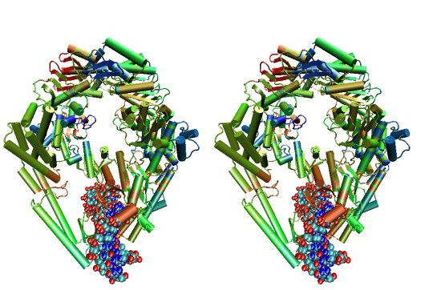
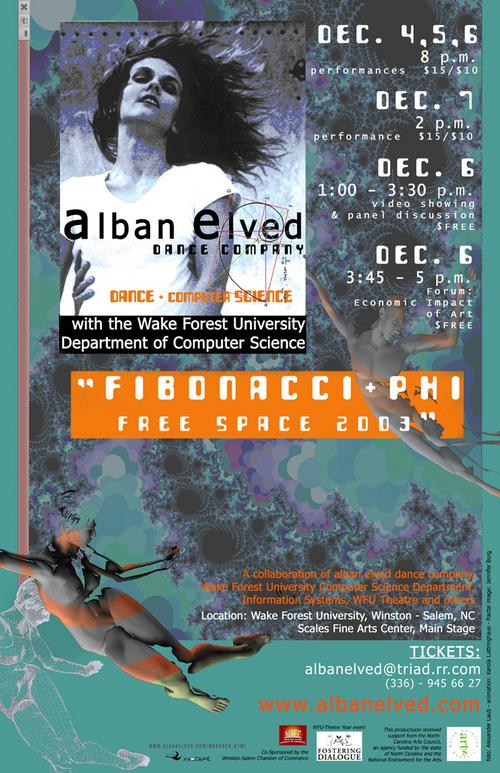

================
Research on DEAC
================

We want to hear about your work!

If you would like to be included in our :ref:`Featured Research section
<featured_research>` below, please send us a brief blurb about your project,
relevant publication info, and any figures you think are representative of your
work.

----------------------------------
Acknowledging DEAC in Publications
----------------------------------

When submitting a publication that includes research carried out on the DEAC
cluster, please include the follwing text in the acknowledgments:

    Computations were performed on the Wake Forest University DEAC Cluster, a
    centrally managed resource with support provided in part by the University.

Once your publication has been accepted for publication, please send us the DOI
and other relevant information to deac-help@wfu.edu.

.. #############################################################################
.. #############################################################################
.. #############################################################################
.. #############################################################################

-------------
Grant Writing
-------------

The general idea is that no single description can fit every grant proposal out
there. Below are three relevant descriptions with various levels of detail on
all fronts. Below are further examples from previous grants, but should not be
considered up to date strictly used beyond context. Please feel free to contact
the HPC Team at deac-help@wfu.edu with your draft composition if you would like
our editorial advice on its accuracy, suitability, etc.

**NOTE:** Technical specs (nodes, processors, memory, storage) will be kept up
to date best as possible. To get accurate numbers, please refer to
:ref:`aggregate information <aggregate_information>` for generic totals or
:ref:`physical hardware specifications <physical_hardware_specs>` for detailed
information on current hardware resources.

.. #############################################################################
.. #############################################################################

Current Actively Maintained Information
=======================================

Official Cluster Two-Liner
--------------------------

    The WFU DEAC Cluster Facility is a centrally managed, University supported,
    high performance computing environment with 95 computational nodes
    containing 3,892 processors, 19TB of total memory, and 170TB of disk storage
    jointly funded by faculty research grant awards and the University. The
    cluster supports faculty in the Biology, Biomedical Engineering, Business,
    Chemistry, Computer Science, and Physics departments. All capital expenses
    and grant contributions will be purchased through the Procurement Uniform
    Guidance, and be open-bid to resellers, and added to this pre-existing
    infrastructure.

Official Cluster Four-Liner
---------------------------

    The WFU DEAC Cluster Facility is a high performance computing (HPC)
    environment that supports faculty in the Biology, Biomedical Engineering,
    Business, Chemistry, Computer Science, and Physics departments. The facility
    is a heterogeneous collection of 95 64-bit Intel Xeon based computational
    nodes, presenting over 3,892 processors, 19TB of RAM and 170TB of disk
    storage, with 10-gigabit low-latency network connectivity. The facility is
    centrally managed by two full time systems administrators who received their
    degrees and/or certifications through the use of HPC Linux clusters. All
    capital expenses and grant contributions will be utilized for contributing
    computational hardware to this pre-existing infrastructure; the
    computational hardware will be purchased through the Procurement Uniform
    Guidance and be open-bid to resellers.

NIH Facility Description
------------------------

Computational equipment
```````````````````````

    The DEAC Linux Cluster has 95 computational blades containing over 3,892
    processing cores dedicated to research and teaching use. The facility is a
    heterogeneous collection of Haswell, Broadwell and Skylake 64-bit Intel Xeon
    based computational nodes, presenting over 19TB of RAM and 170TB of disk
    storage. All of these blades are contained within a Cisco Unified Computing
    System (UCS), sharing a redundant 10G Ethernet fabric; and all of the blades
    utilize a usNIC kernel bypass to reduce latency by 67% to improve research
    that is highly parallel in nature. The cluster storage environment consists
    primarily of a NetApp FAS8040 storage array, hosting over 170TB of shared
    storage via NFS; and an unlimited space, cloud-based archive via NFS from
    AWS. Each storage path presents it's storage via 10-gigabit ethernet
    connectivity from redundant connections; volume configuration follows best
    practices to provide the utmost reliability, availability, and security to
    users. This arrangement provides an efficient presentation to our compute
    nodes, within minimal resource consumption and administrative overhead. The
    cluster also utilizes a virtualization environment with failover redundancy
    to provide three head nodes as well as several maintenance node virtual
    machines for fault tolerant, efficient cluster operation.
    
    The cluster is directly connected to the Wake Forest University campus core
    network router through fiber-based, 10-gigabit Ethernet. Access to the
    cluster by users is possible through any one of three head-nodes. The WFU
    DEAC cluster is co-located at the A1A facility within the Innovation Quarter
    (or Wake Downtown) that includes all research computing equipment for the
    University's Reynolda Campus and School of Medicine. This facility is
    approximately 5000 sq-ft with sufficient cooling and power capacity to
    sustain all current equipment (including the WFU DEAC cluster) as well as
    projected growth.
    
    Internally, the cluster is capable of significant growth. By design, the
    cluster scales on all fronts through the simple addition of hardware:
    computational power scales by adding compute nodes, interactive logins
    scales by adding head nodes, cluster maintenance requirements scale by
    adding maintenance nodes, disk bandwidth scales by adding connectivity to
    the storage arrays, disk capacity scales by adding disk trays to the storage
    arrays.
    
    The current networking infrastructure hardware, based on Cisco's 6500 series
    switches, can support this scalability to over 1000 nodes with
    gigabit-Ethernet to all nodes. Naturally scaling the "access" layer of this
    network, via additional Cisco Catalyst 6500 or Nexus 5000 switch pairs,
    would add support for additional nodes.
    
    Wake Forest University and the College of Arts of Sciences provide
    administrative support for the DEAC cluster at little cost to the
    researchers.
    
    All of the aforementioned cluster hardware is fully supported by the Wake
    Forest University Information Services Department and two full-time
    dedicated Linux system administrators. All capital expenses and grant
    contributions will be utilized for contributing computational hardware to
    this pre-existing infrastructure. Through any Wake Forest University grant
    contribution, the Office of Research and Sponsor Programs will match it
    one-to-one (up to $75K). The computational hardware will be purchased
    through the Procurement Uniform Guidance and be open-bid to resellers.

Major Equipment
```````````````

    N/A, except for the computing equipment described above.

.. #############################################################################
.. #############################################################################

Legacy Unmaintained Descriptions
================================

WFUSM CTSA
----------

One page document written for the WFUSM CTSA proposal effort, due by Fall 2007.
This document highlights the centralized support and scalability of the cluster.
These abilities are crucial for the HPC environment being the solid backbone of
any large scale effort.

This has **not** been updated since the Fall 2007 submission.

    The WFU DEAC HPC cluster is a research computing environment that is
    centrally maintained by the University. The cluster administrator team
    currently consists of Timothy Miller and Yonas Abraham, both of whom have
    obtained doctoral degrees in Physics using HPC clusters. This computational
    experience affords an understanding of user operational needs and allows for
    a better and more effective match of cluster design to the problems being
    studied.
    
    WFU DEAC provides unique capabilities to campus researchers that are not
    available from general campus computing: high speed networking
    infrastructure, large scale storage and computational capacity.
    Architecturally, WFU DEAC is a Linux-based Beowulf style cluster consisting
    of 360 processors with 1 GB RAM per processor. These processors are
    distributed among 153 nodes, each with gigabit Ethernet connectivity. A
    subset of these nodes uses specialized, high speed, low latency
    interconnects: 24 nodes (96 processors) use Infiniband based standard, 16
    nodes (32 processors) use the Myrinet based technology. Currently, all user
    accessible nodes (login and computational) have direct access to 15 TB of
    usable storage available through the high performance, parallel filesystem.
    
    The WFU DEAC cluster design allows for a great deal of scalability in the
    key areas of storage and computational nodes. We use IBM's *General Parallel
    File System* (GPFS) software to manage and present the disk storage
    connected to the cluster. GPFS provides every key function that a cluster
    requires for its data access: fault tolerance, redundancy, transparent
    maintenance, scalability in performance (multiple GB/s), and scalability in
    capacity (2 PB tested limit). With current SAN switch hardware, we can grow
    our storage pool to include an additional 24~storage controllers, each of
    which could provided 40-50 TB of storage~(1.0-1.2 PB). Our computational
    nodes also enjoy significant growth potential. GPFS has a current limit of
    2440 nodes. Existing switch hardware will allow for an additional 680
    computational nodes. The purchase of expansion modules currently available
    for these switches would allow an additional 480 computational nodes. Growth
    beyond these additional 1160 nodes simply requires the purchase of another
    networking switch.
    
    As a whole, these technologies allow WFU DEAC cluster researchers to explore
    a great many computation problems that exist in research today. The Myrinet
    and Infiniband technologies provide the low latency, high bandwidth
    communication that is essential for difficult parallel processing problems
    (fluid dynamics, thermodynamics, black hole dynamics). The high performance
    and large scale filesystem provides the backbone upon which users can tackle
    the large data set problems (Monte Carlo simulations, genetics,
    bioinformatics, nuclear/particle physics). Of course, the cluster is also
    well suited to \`\`traditional'', single processor problems that have no
    preconceived parallelization. With multi-core processors and compiler
    technology, even traditional software can see some performance gains using
    the WFU DEAC cluster and the compilers we license through compiler vector
    optimizations.

NSF MRI
-------

Excerpt that has been adapted for relevance in this forum taken from the WFU
DEAC Rep Com grant proposal for NSF MRI funding in January 2005.

Impact on WFU Research Goals
````````````````````````````

    The most important impact of the WFU DEAC facility is the promotion and
    support of cross-department and cross-campus research collaborations. Over
    its 5 year existence, the facility has helped to catalyze tremendous
    cross-fertilization between research groups. This initiative has produced a
    number of collaborations with experimentalists in the Medical School, the
    Cancer Biology Center, and the Structural Biology Center that would be
    impossible without the cluster. Through interactions and projects that were
    initiated partly as a result of the cluster's availability, a Structural and
    Computational Biophysics Graduate Track has been developed. A computational
    chemistry-physics group has evolved and meets monthly to share research
    results. Research collaborations with other institutions, such as UNC-Chapel
    Hill and USAMRIID, have developed since the creation of the DEAC cluster.
    One researcher collaborates with a faculty member from Winston-Salem State
    University, a historically black university, who writes the parallel
    programs for use on the DEAC cluster. Finally, collaborations with industry,
    including Targacept, ReceptorSolutions, and Nanosonic have developed.
    Targacept and ReceptorSolutions have ongoing and pending STTR proposals to
    the NIH and the NSF with researchers (including J. Fetrow, PI, and P.
    Santago, Investigator) in the departments of Biomedical Engineering,
    Physics, and Computer Science.

    The Wake Forest University DEAC cluster allows the pursuit of these types of
    research projects within the liberal arts curriculum. In this environment,
    both graduate and undergraduate students are actively engaged, working in
    small groups, directly mentored by faculty. A unique example of the
    interdisciplinary use of the DEAC cluster at this liberal arts university is
    that of Tim Miller (co-investigator), Jennifer Burg, and Yue-ling Wang, both
    in the Computer Science Department. Together with a local modern dance
    company, these researchers use the cluster for an annual multimedia dance
    performance. They published a paper entitled "Cluster Computation in Step
    with Real-Time Dance: An Experiment in Art/Science Collaboration"in the 17th
    International Conference on Parallel and Distributed Computing (2003) and
    were invited to do a special presentation at the conference. Students
    actively participate in these types of unique collaborations.


Impact on the WFU Educational Mission
`````````````````````````````````````

    The University's support of a strong IT infrastructure and excellence in
    teaching has actively encouraged faculty to innovate with computers in their
    teaching. The installation of the DEAC cluster has added significantly to
    the resources at our disposal and allows both undergraduate and graduate
    students access to state-of-the-art computing facilities.

    From the beginning, the cluster has been organized for use as a classroom
    tool, with temporary student accounts, special queues for course use, and
    disk space set aside for student- and course-generated data. Currently 6
    courses (Bioinformatics, Physics of Biological Macromolecules, Parallel
    Computing, Building Beowulf Clusters, Quantum Chemistry and Advanced Image
    Analysis) have implemented use of the cluster so that students have hands-on
    experience with parallel computing in these fields. The cluster has allowed
    the development of several new courses, including Building Beowulf Clusters
    and Computational Molecular Biophysics Laboratory. The course, Building
    Beowulf Clusters, is unique and not offered in many places. Parallel
    Computing, draws on the cluster in its curriculum with considerable success,
    at least as judged by student comments. The course in quantum chemistry now
    provides access to state-of-the-art computational chemistry tools, allowing
    students to explore the structure of molecules in ways previously
    unavailable.

    Faculty members associated with this proposal are teaching graduate and
    undergraduate courses that exploit the latest pedagogical theory and tools.
    Drs. Fetrow and Salsbury developed and co-teach the Computational Biophysics
    Laboratory and complementary lecture course, Physics of Biological
    Macromolecules. In these interdisciplinary courses, students learn and apply
    the basic principles of protein structure, thermodynamics, and
    electrostatics. The lecture alternates between core material and discussions
    of crucial papers, highlighting applications to research problems in protein
    structure and function. The laboratory is project-based; students study
    their assigned protein and write a research paper presenting and critically
    reviewing their results, which is reviewed by other students in the class.
    The laboratory part of this course would not exist without access to the
    DEAC cluster. This year, the class studied the peroxiredoxin protein
    structures, learning how to run various molecular mechanics and
    electrostatic calculations (on the cluster) and interpreting those in terms
    of protein structure. Undergraduate and graduate students from the
    departments of Biochemistry, Biology, Chemistry, and Physics as well as
    auditors from the local biopharmaceutical company, Targacept, attended.

    Our teaching efforts impact both women and minorities. Two of the DEAC
    cluster major users are women (Fetrow and Holzwarth) and both teach courses
    that utilize the cluster. Both have been successful at mentoring women in
    the sciences. One graduate student and one research associate in their
    current laboratories are women. At another university, J. S. Fetrow had
    three women win awards for undergraduate research under her direction. Drs.
    Cook, Holzwarth, and Fetrow teach in the introductory physics courses at
    Wake Forest and, in that context, make efforts to recruit students pursue
    studies in the sciences, particularly computational physics and biophysics.
    The Physics department has had great success attracting women into their
    courses. Usually, over half of the students registered for these
    introductory courses are women.

.. #############################################################################
.. #############################################################################
.. #############################################################################
.. #############################################################################

----------------------------
Managing Research Group Data
----------------------------

Background
==========

By and large, the most difficult issue to effectively manage with a large
research group (that is, greater than 1 person!) is the data created on the
cluster by everyone in that research group. Subtle issues related to disk
storage and data ownership can make results someone you supervise has generated
be completely inaccessible to you! Some effective research group policies
regarding how your users function can help reduce the stress and frustration of
having all the results but not being able to view them. This article covers some
background information and strategies to help you develop those policies in your
group.

Account Convention
------------------

Accounts on the cluster are created such that each user has their own primary
group. This is the default convention followed by Red Hat and adopted by the WFU
DEAC cluster. This convention means that, when a user creates a file or
directory, it will be typically be owned and grouped using that user's primary
memberships.

* The caveat to this convention involves files created in a job submitted to the
  cluster. Cluster jobs run as the user submitted (as you would expect) and as
  the fairshare group under which the job was submitted (not expected). So, for
  user BOB submitting a job under the generalGrp fairshare group, all files
  created by the job will be ``BOB.generalGrp``.

Group Convention
----------------

All users are assigned to multiple groups. These groups include the "fairshare"
group (under which your priorities are determined by the cluster scheduler),
your primary research group (which could also be the fairshare group), your
primary department, a general research collaboration group, etc. Any user can
change the group membership of a file or directory that of which they are a
member (and have permission) to any other group to which they belong.

Group Sticky Bit
----------------

UNIX/Linux has this concept of a "group sticky bit" that can be set on a
directory. By setting the bit, you are making the group membership of that
directory "sticky", that is you declare that all new files and directories
created in that directory will have the same group membership of the parent. A
common misunderstanding of the sticky bit is that it changes existing files and
directories, which it is does not! Only newly created files/directories. This
sticky bit overrides any default behavior that is in effect for file or
directory creation, even the SLURM job group membership behavior!

Maintaining Group Ownership
===========================

The general idea is simple. Create a primary level directory with the correct
group membership and sticky bit set so that all directories and files underneath
now belong to the group. Below the desired directory, run the following
commands:

.. code-block:: console

    $ chgrp researchGrp /deac/researchGrp
    $ chmod 2770 /deac/researchGrp

The remaining steps involved require a group policy set up by the research
group. This policy must include two key features:

1.  All users must create their data files in that directory tree. You may want
    to have someone do a quarterly audit of the directory to ensure all the
    contents still have the correct group memberships.
2.  All users must have a specific ``umask`` in the login configuration files
    (``.bashrc`` or ``.tcshrc``) such that the group permissions have at least
    read access and maybe even write access (``umask 027`` or ``umask 007``,
    respectively)

Restricting Access
==================

You want everyone in your group to be able to read and write to the directory
but no one else. For convenience, you'd like the filesystem and/or users to
automatically ensure these permissions in order to avoid that last minute
deadline hitting and you can't read the one file that you need.

First let's ensure your researchGrp directory is group writeable:

.. code-block:: console

    $ chgrp research /deac/reserachGrp
    $ chmod g+w /deac/researchGrp

Group access only
-----------------

Remove all access to non-group members:

.. code-block:: console

    $ chmod o-wrx /deac/researchGrp

World readable
--------------

Assuming you have run the "Group access only" command... If you want non-group
members to have read only access, but not edit privileges:

.. code-block:: console

    $ chmod o+r /deac/researchGrp

.. #############################################################################
.. #############################################################################
.. #############################################################################
.. #############################################################################

.. _featured_research:

-----------------
Featured Research
-----------------

.. #############################################################################
.. #############################################################################

Structural Comparison of ATP-binding Effects
============================================

An illustration of the structural effects of ATP binding on DNA-bound MutS
structures. The binding of a second ATP to MutS causes conformational changes,
illustrated by color, blue for the largest conformational changes, green for
intermediate changes and red for the smallest changes. The MutS comples is the
prokaryotic equivalent to the MSH2/MSH6 complex, which are key mismatch repair
proteins functioning in both cell death and repair pathways. Conformational
changes in MSH proteins are critical to the regulation of these pathways.



This research was conducted on the DEAC cluster by `Professor F. Salsbury
<http://bob.olin.wfu.edu/~web/>`_ of the Physics department who collaborates
with the Scarpinato Lab in the Cancer Biology department.

.. #############################################################################
.. #############################################################################

Fibonacci and Phi
=================

One of the first attention getting efforts put for by the cluster was a
collaboration between `Wake Forest University <http://www.wfu.edu>`_ faculty and
performing arts groups. While this page showcases those past collaborations, we
are always open to exploring new, extreme, and unconventional uses of high
performance computing capabilities in works of visual and performing arts as
well as other disciplines in the Humanities.

`Fibonacci and Phi: Free Space 2003 <http://www.albanelved.com/fibonacci.html>`_



As part of a collaboration between the `Alban Elved
<http://www.albanelved.com>`_ dance company and the Wake Forest University
`Computer Science <http://www.cs.wfu.edu>`_ Department, "Fibonacci and Phi: Free
Space 2003" combines the realms of art and science into a single performance.
Inspired in part by Wake Forest University's 2003-2004 `Theme year
<http://themeyear.wfu.edu>`_ focus "Fostering Dialog: Civil Discourse in the
Academic Community", the performance challenges the notions of apparent conflict
between the arts and the sciences.

Of direct relevance to the WFU DEAC Osiris cluster, the performance uses real
time generation of fractal images. The dancers trigger particular actions (zoom,
move up, move down, etc.) on the stage through laser beam sensors that are
converted to MIDI signals. These MIDI signals are captured on-stage and
forwarded to the cluster. A MPI-based Mandelbrot program receives the signals,
calculates the fractal image, and ports the X-Windows graphics back to the
on-stage system where it is displayed.

Three nightly performances took place from December 4-6, 2003 and one matinee
performance was held on December 7, 2003. Following each performance, the
members of the production would hold a question and answer session to address
issues related to the production, ranging from technical details to guiding
themes of the event. In addition, two afternoon forums were held in conjunction
with the production to further the dialogue.

In addition to the performances, the scientists (Drs. `Jennifer Burg
<http://www.cs.wfu.edu/~burg/>`_ and `Timothy Miller
<http://www.wfu.edu/~millerte/>`_ involved in the project presented a paper,
"Cluster Computation in Step with Real-Time Dance", to the `International
Society for Computers and Their Applications <http://www.isca-hq.org/>`_ 17th
International Conference on Parallel and Distributed Computing Systems
(PDCS-2004).

### Related Links

* `WFU starts 2003-2004 theme year dedicated to dialogue, civil discourse
  <http://www.wfu.edu/wfunews/2003/082003f.html>`_
* `Dance and Digital Media: A Collaboration of Dancers, Artists, and Computer
  Scientists
  <http://csweb.cs.wfu.edu/~burg/albanElved/DigitalMediaDanceCollaborations.htm>`_
* `Alban Elved Dance Company website <http://www.albanelved.com/>`_

.. #############################################################################
.. #############################################################################

Computer Modeling of Crystalline Electrolytes
=============================================

:download:`Final paper <files/JES00A538.pdf>`

Department: Physics Author(s): N.D. Lepley, N. A. W. Holzwarth

Notes/Questions/Thoughts:

    * Does electron localization play a role? Doesn't seem to be relevant
    * Van der Waals interactions? No
    * Climbing image NEB vs. regular
    * Supercell size effects
