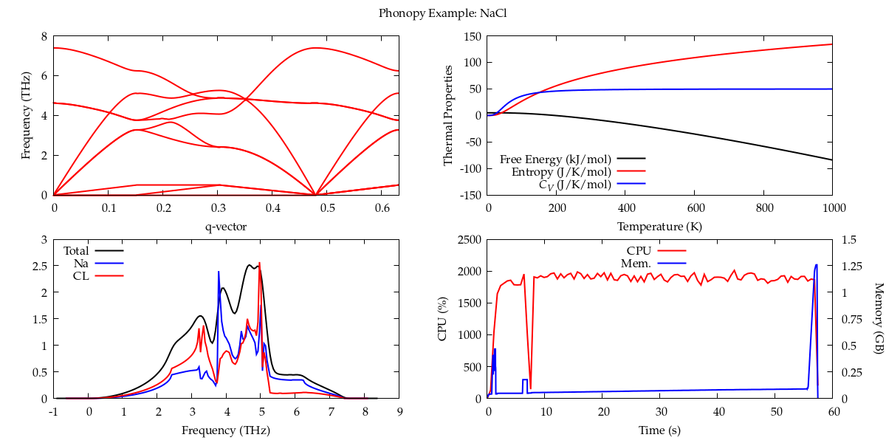

===============
Python Packages
===============

.. #############################################################################
.. #############################################################################
.. #############################################################################
.. #############################################################################

-------
Phonopy
-------

Website: https://phonopy.github.io/phonopy

Introduction
============

Phonopy is an open source package for phonon calculations at harmonic and
quasi-harmonic levels.

Installation
============

We are going to install Phonopy from source, in your local user account. We will
integrate it with the Intel Distribution for Python (3.7.4) that comes with the
Intel Parallel Suite XE 2020. This distribution comes bundled with highly
optimized math libraries, such as the Intel MKL, offering better performance for
numerical calculations. We will be following `the official installation
instructions <https://phonopy.github.io/phonopy/install.html>`_ from the
developer.

Load the module for the aforementioned Python distribution

.. code-block:: none

    module load python/intelpython3/3.7.4

and verify that the correct Python binary being used with ``which python``

Download the `latest release from GitHub
<https://github.com/phonopy/phonopy/releases>`_, or clone `the repository
<https://github.com/phonopy/phonopy.git>`_ if you want to stay current with the
development releases. Either way, go into the directory and modify the
installation script; change the line

.. code-block:: none

    with_openmp = False

from ``False`` to ``True`` to enable the built-in OpenMP parallelism. Run the
installation script,

.. code-block:: none

    python setup.py install --user

The ``--user`` flag will tell python that this is going to be a local
installation. You may also want to install Tornado, which is one of the
graphical dependencies of Phonopy,

.. code-block:: none

    pip install tornado --user

This will allow Phonopy to display plots for viewing with a web-browser;
however, it is incredibly slow since you are connecting via SSH to a remote
machine. We also so not allow any calculations on the head nodes, so the
prefered way to use the software is via our queue system, Slurm.

Finally, execute the following lines to have access to the newly installed
package withing your environment and Python scripts,

.. code-block:: none

    export PATH="$HOME/.local/bin:$PATH"
    export PYTHONPATH="$HOME/.local/lib"

or add them to your ``.bashrc`` to make these changes persistent.

Usage
=====

We will be calculating some properties for NaCl from the `official Phonopy
examples <http://phonopy.github.io/phonopy/examples.html#nacl>`_. You can
download the :download:`prepared files <files/phonopy-NaCl.tar.bz2>` if you want
to run the calculation for yourself. An example Slurm script could be like this:

.. code-block:: slurm

    #!/bin/bash
    #SBATCH --job-name="phonopy-NaCl"     # Name that appears in queue
    #SBATCH --partition=small             # Resource group (small/medium/large)
    #SBATCH --account=generalgrp          # Research group
    #SBATCH --nodes=1                     # Number of Nodes
    #SBATCH --ntasks-per-node=1           # Number of tasks (MPI processes)
    #SBATCH --cpus-per-task=20            # Number of threads per task (OMP threads)
    #SBATCH --mem=4G                      # Requested memory
    #SBATCH --time=00-00:05:00            # Job duration in DD-hh:mm:ss
    #SBATCH --output="SLURM-phonopy-%j.o" # Slurm stdout, %j is the job number
    #SBATCH --error="SLURM-phonopy-%j.e"  # Slurm stderr, %j is the job number
    #SBATCH --mail-type=BEGIN,END,FAIL    # Mail sent on begin, end/failure
    #SBATCH --mail-user=user@wfu.edu   # User email
    
    # Load the Intel Python module
    module load python/intelpython3/3.7.4
    
    # Set the number of OpenMP threads to be used equal to the Slurm allocated CPUs
    export OMP_NUM_THREADS=$SLURM_CPUS_PER_TASK
    
    # Run the program
    cd $HOME/phonopy-NaCl
    python NaCl.py

It will run the calculation on 20 cores on a single node using OpenMP
parallelization. It should take less than a minute, and yield results that
closely match the website.

The bottom right-hand plot show the CPU and memory usage throughout the
calculation, topping out at 2000% (100% x 20 cores) and ~1.25 GB, respectively.
